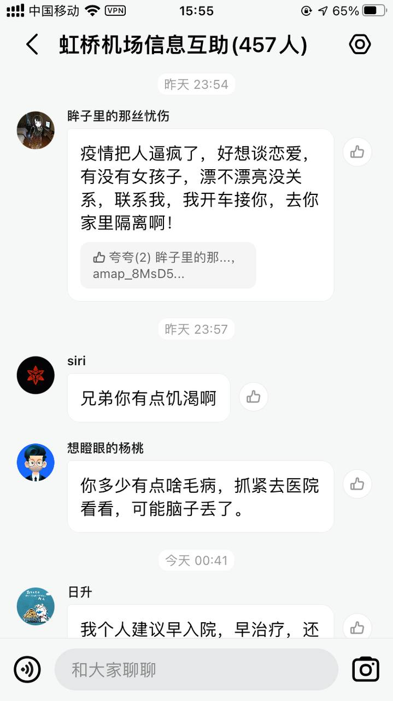
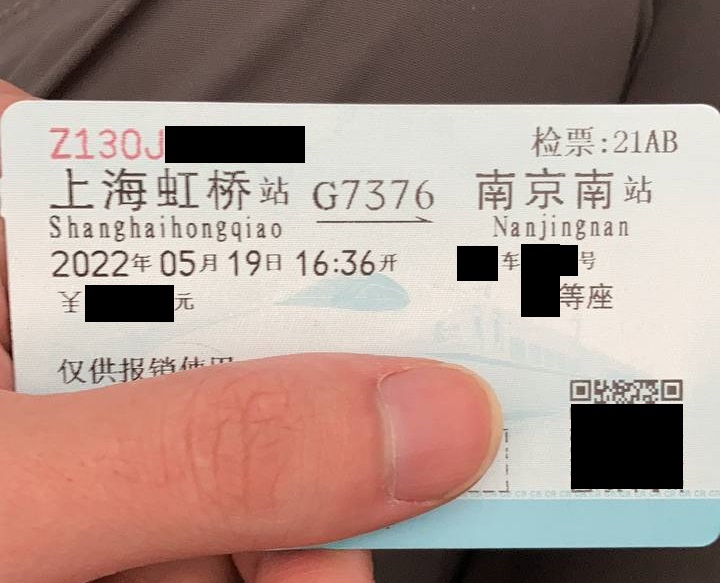
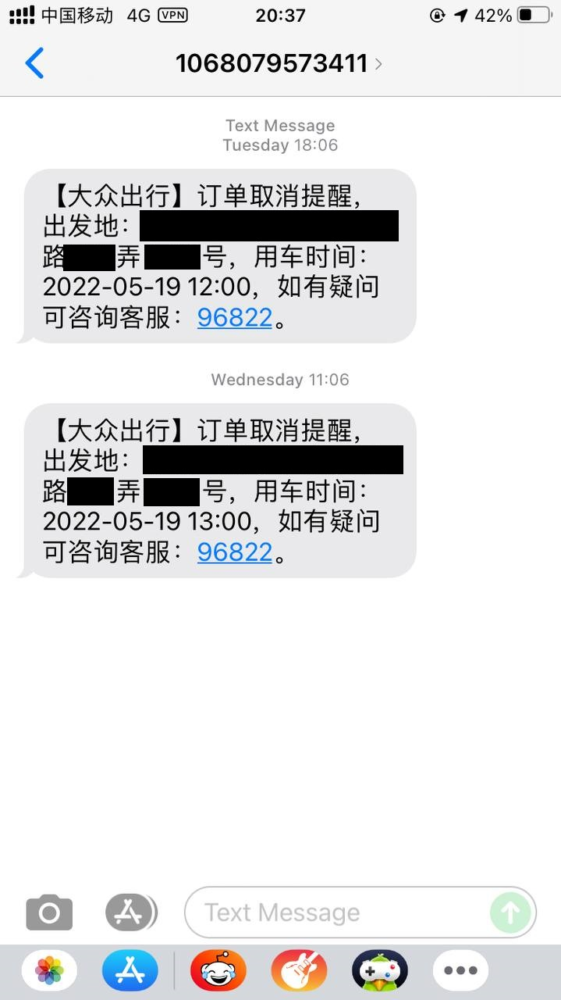
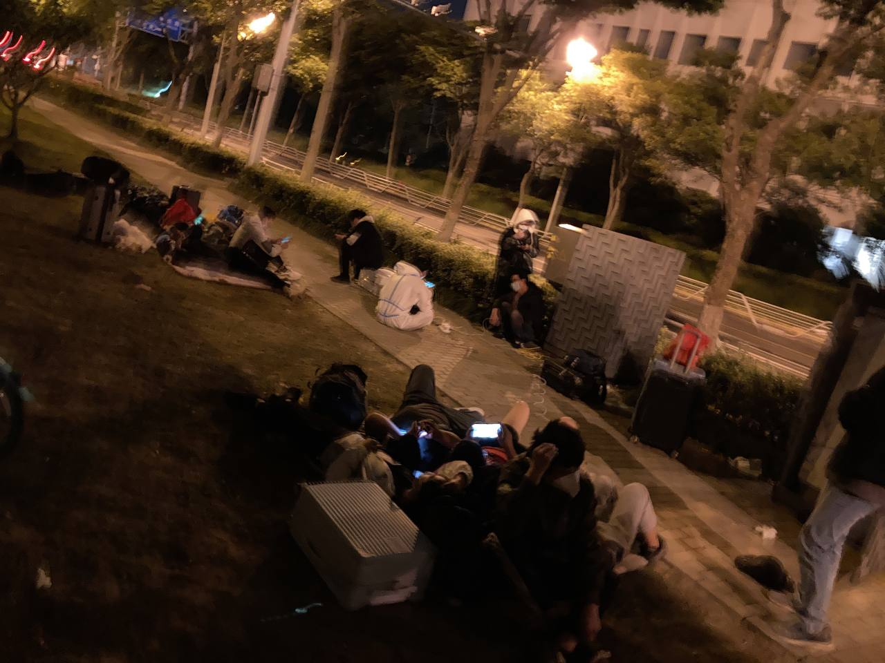
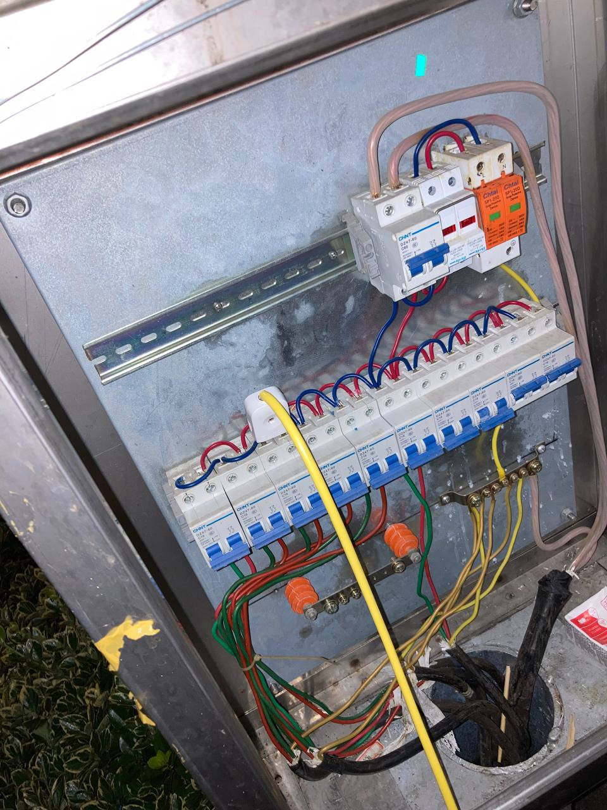
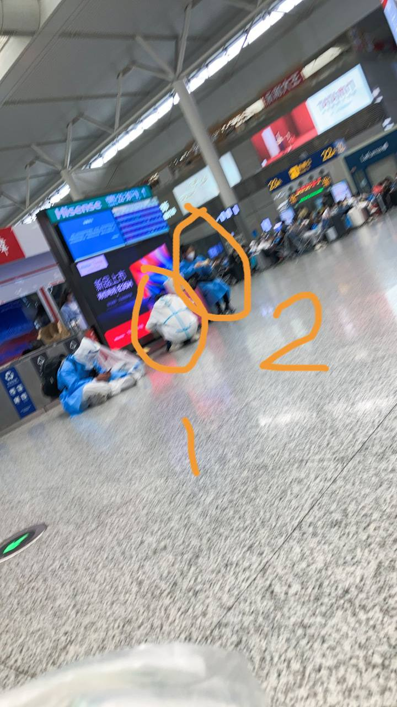
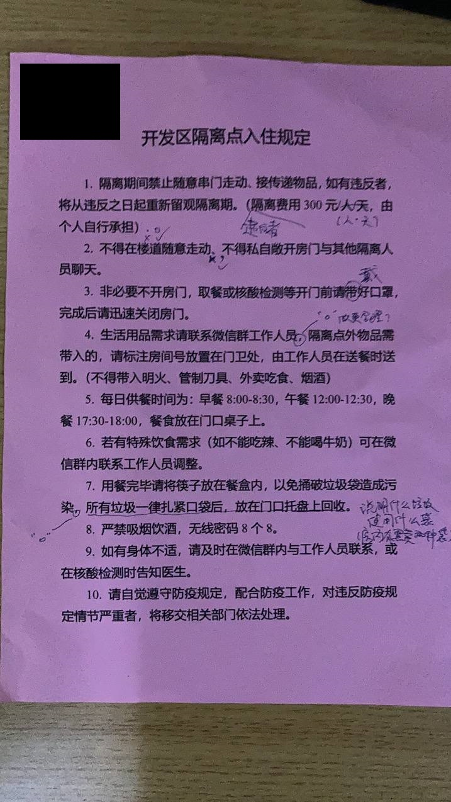

# 出上海记

Copyright Notice: Linking, sharing and redistribution of this work in any form is forbidden without written consent from the author.

> **上海笑话**
>
> 　　2022年春，乌克兰战争爆发以来，很多地区受到战火波及，生活物资短缺；俄罗斯国内由于受到制裁，进出口贸易受阻，同样也出现了部分物资缺乏的情况。以下选项中饥荒最严重的地区是？
> 
> - A、基辅
> - B、马里乌波尔
> - C、莫斯科
> - **D、上海**

　　2022年以前的很长一段时间里，没有人会否认上海是一座国际大都市的事实。国外资本家纷至沓来，国内求职者趋之若鹜，大家似乎都有美好的未来。更有许多人认为上海是国内城市中文明、法治、讲规矩、讲人文关怀的模范生，实际上就连我本人在初到上海的几个月里，就成为了一名高纯度的“精沪分子”。“上海人看不起外地人那是有他们的道理的”——那时候我对上海的印象就是有这么深刻。

　　然而到了2022年4月，我却开始绞尽脑汁地想要逃离上海——当时我有多么喜欢这里，现在我就有多么想要离开这里。我以后还会再来吗？我不知道。唯一可以确定的是，上海永远不会缺人：现在跑走了多少人，以后还会跑进来更多。但到时候再跑回上海的人里有没有我，就实在不是现在的我能够预料到的了。

　　在这里我愿为大家分享我逃离上海的魔幻旅途，但在这之前，让我们先来梳理一下逃沪这门“学科”的发展史——

## 逃沪年代

> **上海笑话**
>
> 张三被警察以散布谣言的罪名逮捕了。
>
> 张三：“凭什么？我不是说上海马上封城七天吗？我哪里散布谣言了？”
> 
> 警察：“**上海封了都五六十天了，你这不是散布谣言是什么？**”

（以下日期若无特殊标注，均是指2022年）

### 黑暗纪元

　　4月5日至5月1日。

　　多少年轻而单纯的上海民众听信了政府的谣言，对4月5日解封抱有不切实际的幻想。他们只买了一个星期的食品和日用品，等来的却是遥遥无期的解封，和猝不及防的铁窗生活。4月2日晚上的消息——“明天的核酸先不做了，昨天的结果不太好，大家先在家里做抗原”——让我嗅到了一丝危险的味道，然而为时已晚。果不其然，承诺的4月5日平静地过去了，没有在物质世界里激起一丝水花。多少自以为是的专家预测不断给人们带来一点希望：“4月中旬”、“4月底”、“5月中旬”，以及最后的“6月恢复正常生产生活秩序”，但你点进去才会发现6月中下旬也算6月。多少别有用心的小道消息给人们的生活增添色彩：“孙春兰用自己的人把本地的人全换掉了，有功劳她揽着，有锅本地人背”——结果第二天果真按他说的，停用健康云，改用“随申办”核酸码[1]，这件确实发生了的事情还真让这个小道消息真假难辨。后来出来的阿尔法变体——“孙春兰和李强互斗，李强斗赢了，明天重启健康云”却终究是没有发生，也许是市委市政府的窃听器感染了奥密克戎病毒导致听力下降，又或许从一开始就没有什么小道消息，我只是“找两万个人群发体育彩票预测消息，一半说中国队赢，一半说朝鲜队赢”的古老骗术[2]中，幸运地在第二批被刷下来的一个罢了。

　　这段时间里，我还勉强能保持一点工作效率，虽然也是摸鱼不停，但好歹还做出来了一两个新功能。可是这种状态并没能持续下去。本来我来上海也只是为了准备升学罢了，随着开学日期渐渐接近，当我看到有人分享逃离上海的经验时，我终于坐不住了。

> [1] “健康云”是一个上海本地的微信小程序，集合了本地医疗卫生系统的一些服务。封城初期，市民需要在“健康云”里填写信息申领“核酸码”，检测前由工作人员扫码录入信息。“随申办”是本地的另一个小程序，上海的“健康码”就是从这里申领、展示的。4月中上旬，“随申办”突然上线了一个“核酸码”功能，同时市民接到通知不再使用“健康云”，改用“随申办核酸码”登记检测信息。从务实的角度来说，这个改动是给市民带来了方便的，因为“健康云”每次测试前都需要申领新码，而“随申办核酸码”申领一次可管一个月。为什么是一个月我暂且蒙在鼓里，也许他们觉得一个月这么长时间肯定可以清零吧？
>
> [2] 该骗术英文名称为 Baltimore Stockbroker scam，操作方法是这样的：首先找两万个人，向其中一万人发送体彩预测信息，称接下来的中国对朝鲜的足球比赛中，中国队会赢，向另一半说朝鲜队会赢，结果比赛结束中国队赢了，之前发送朝鲜会赢的一万人就扔着不管，发送中国队会赢的一万人则继续分组，向五千人说下一场中国对越南赛中国队会赢，另五千人说越南会赢，结果中国又赢了，就把发了越南赢的那五千人再去掉，剩下五千人继续分一半……这样连续四五次，最后筛选剩下来几百人，就总会有几个觉得这个骗子连续预测五次球赛全部正确真的有预知未来的异能，接下来骗子想忽悠什么，这些人都容易听进去。不过这个小道消息不太可能是这种骗术的实践，就算是，我也不会是其中的目标，因为我是从面向不特定多数人的公开发布渠道中看到不知道被人转发多少次的截图的，并不是直接收件人。

### 启蒙纪元

　　5月1日至5月17日。

　　长假让我好好打了几天游戏，放空了自我，但假期一结束，上班的忧郁又如潮水般袭来。这段时间似乎极为有限地恢复了一些“正常生产生活秩序”：

> 
> 
> 图0 《静待阳光万里》

　　5月上旬我陆续看到了几条逃沪成功者的经验，但都没怎么引起我的注意，直到5月11日我看到了一篇这样的文章：

> [逃离上海？最新离沪手册来了！](http://telegra.ph/%E9%80%83%E7%A6%BB%E4%B8%8A%E6%B5%B7%E6%9C%80%E6%96%B0%E7%A6%BB%E6%B2%AA%E6%89%8B%E5%86%8C%E6%9D%A5%E4%BA%86-05-11)
>
> 作者：实用派 来源：上海文艺青年

（此链接为存档，原文已被作者删除。直接打开只能看到文字，用 Telegram 手机客户端打开才可看到图片）

　　这篇文章讲得很细，看起来很真实，也和部分我已经了解到的信息一致。我立刻开始根据自身实际情况整理信息，有不详尽的就打电话询问。这期间网上又出现了一些逃沪成功的新闻，也有传统媒体写的报道，每一篇都看得让人心痒痒，但从实际操作角度上给人带来的帮助都不如上面那篇大。这些报道和文章，以及我从居委、市民热线等渠道自己问来的信息，让我感觉到逃沪这件事情“可行，但不是完全可行”，这种~~勃起了射不出来~~，不是，半死不活的感觉让我异常痛苦，在经过和公司领导两个半小时的彻夜长谈后，我终于在5月13号正式离职，开始做一名全职的逃沪学者。

> 
> 
> 图1 自己搜集的逃沪信息整理

### 暴涨纪元

　　5月17日至今。

　　新闻报道称5月17日虹桥站离沪人员从之前的每天1000人暴涨到一天7000人。票很难买，但票一直很难买，更难的是打车：5月11日我尝试拨打大众出租车021-96822热线订车，很快就接通了，对面也非常爽快地说可以订车，但当时我没有车票和出门证，只是问了一下就挂断了；5月17日我再打的时候，从上午11点打到晚上5点半终于打通了一次（期间还收到短信“您本月套餐外语音费用已超20元”），约车还没有成功。我认为这个现象很能说明试图逃沪、搞得到车票和小区出门证的人数的增加情况。车票的数量也在明显增加，现在（5月23日）上海到南京的车次已经增加到每天20列左右，有些车次甚至不需候补直接有现票可买。

　　“高德地图”里将地图拖到虹桥机场附近，可以看到一个叫“虹桥机场信息互助”的群，里面会有各种信息分享，但总体来说问问题的比分享经验的多。随着逃沪人员的不断增多，部分人员面临的心理问题也逐渐暴露出来……

> 
> 
> 图2 好想谈恋爱，去你家里隔离啊！

### 未来纪元

　　多篇新闻报道里受访者都指出，“今天遇到的问题可能明天就不存在了”。5月16日买不到火车票，也许5月17日就买到了；5月15日出不了小区，也许5月16日就能出了。我住在桥下那晚听说湖北武汉和山东济南外地人过去也可以免费隔离，现在的情况似乎又有所变化。不管怎么说，我已经逃出来了，自然不会再关注逃沪实际操作的问题。前几天我还会在高德地图的“虹桥机场信息互助”群里向难兄难弟们分享我的经验，现在我已经不敢了——谁知道我所了解的情况还是否准确呢？

　　未来是充满不确定性的。就像进站的核酸检测阴性报告必须要在48小时内一般，逃沪信息也请以最新的为准，最好自己打电话问。

> 
> 
> 图3 现代人类的保质期

## 难民纪实

### 5月18日前，上海

> **上海笑话**
>
>　　上海某小学网课直播老师对孩子们说：大家不用担心，上海是国际大都市、防疫模范生，全国都在支援我们，目前物资充足，医疗保障好。
>
>　　下面的孩子们纷纷高兴地说：**好耶！我要去上海！！**

#### 为票痴狂

　　任何经常往返上海和南京的人都知道，上海和南京之间的火车票就连幼儿园小朋友都能买得到。380标准的京沪高，300标准的沪宁城际，以及每天早上准时晚点的绿皮直特群，共同构成了每天超过100个的选择。然而上海封城后，你的选择瞬间减少至2个（之后回升至5个），而且都不是上海始发南京终到的列车，也就意味着会面临区间限售。

　　我在5月11日左右第一次查票，5天的车票预售期内，绝大多数车次席位都已经到达候补队列满的状态（注意不只是售完，而是“候补队列满”，也就是你想候补都候补不了了），有少量席位还有候补位置，但当时我没有得到小区出门证，因此没有购买。

　　5月16日，我第二次查票，上海虹桥站下午一点半放出5月20日的票，我对着电脑时间13:29:59下拉刷新，手机屏幕上的文字从“13:30开售”直接变成了

> 商务：候补　一等：[候补]()　二等：[候补]()
 
　　如此险恶的条件下，我终究是没有抢到票。后来我和我妈相继用携程旅行、智行火车票预约抢票，想着随缘吧，结果第二天（5月17日）早上9点多我接到我妈的电话，说她给我抢到5月19日的票了，一等座。

> 
> 
> 图4 车票

　　这里我有一个理论：平时大家往返南京和上海，如果某一趟车的二等座卖完了一等座还有，会选择时间相近的另一趟车的二等座，所以买一等座的人会比买二等座的人少很多；现在大家要从南京到上海，如果某一趟车二等座卖完了一等座还有，会选择加钱抢一等座，所以买一等座的人不会比买二等座的人少太多。而一等座的绝对数量又比二等座少很多，因此现在买一等座不一定就比买二等座更容易。请大家分析一下这个理论是否正确，如果不正确，有什么问题。

　　我算是幸运的，相对不那么困难地就抢到了票，但不是每个人都有这么好的运气。根据我在进站路上和候车厅里听到的三言两语，很多人是从黄牛手里买到的车票。我不太了解现在的黄牛产业，以及实名制电子客票场景下具体如何操作，但从不同人嘴里听出来的黄牛加价，从300到2000不等（智行火车票抢票也可以加钱提速，但加钱的金额没有这么离谱）。上海到南京一张二等座也就不到150块钱，黄牛这回可是要赚翻了。

　　另一些人，比如我的两位同期逃沪的老乡，是5月17日晚上刷手机的时候突然发现放了很多票，就直接买了。他们在比我晚的时间和我买到了同一趟车的票，这不能不说是等待的胜利。

#### 出境签证

　　所有逃沪指南和报道里必定离不开两种证明，一种叫“接收证明”，一种叫“离沪证明”。前者为目的地（老家）居委会出具，证明你回去了会有人接收，后者为出发地（上海的现居地）居委会出具，证明你要离开上海，解封前再也不回来。有些出发地居委需要看到前者才会签发后者（类似于申请外国签证时大使馆要求申请者证明在本国或其他地方的居留权，以减少入境后护照一撕黑在当地的风险）。

　　接收证明南京不开，这点上面的文章里也说了，我打电话问居委，居委说是上面的授意。而离沪证明，我5月11日第一次问居委的时候，也是不开的。他们的原话是：“现在我们只能开闭环到定点医院就医的出门证，如果你有急事要走，我们可以给你在上面备注一下，但路中间警察拦不拦[3]我们就管不到了。”我估计肯定要拦吧。

　　5月16日我早上做完核酸，再次打电话问居委，这次他们答应得相当爽快：“我们也是刚刚接到通知，你要走可以直接来开出门证。”好像已经什么限制条件都没有了。我也没冲动，5月17日买到火车票之后才跑到居委，他们先问我是自己开车还是公共交通，我说坐火车，他们倒是问了我是不是已经买好票了，我也不知道如果我说没有还给不给我开。他们也提了目的地接收证明的事情，但我告诉他南京都没有这个，他也没在意，就说了一句反正只要你回去有人接收就行。接着他复印了我的身份证，拿了出门证出来让我填。

> 
> 
> 图5 沪国出境签证

　　出门证有两张，一张叫“公共交通离沪证明”，内容是姓名、身份证、事由、目的地、车次日期时间、联系方式和签字；另一张叫“离沪回乡承诺书”，内容是姓名、身份证、联系方式、现住址、核酸报告日期、事由、目的地、出发日期、交通方式，以及“本人承诺外出期间两点一线，做好个人防护。如果造成不良后果，本人承担相应责任”的字样和签字。两张证明均一式两份，盖上居委会的章。

　　值得一提的是，“公共交通离沪证明”上写着“该证明自出发时间前6小时起有效”，但居委的说法是这是统一模板，我们这你想走随时走都行（只要不回来）。所以我确实在出发时间前20多个小时就离开了小区，没有受到任何阻拦。而和我同期逃沪的一位老乡告诉我，她的小区开的离沪证明只有一张（我不记得是哪一张了，反正和我这两张中的一张是一样的）。所以我也不知道这个“统一模板”究竟是什么范围里的统一。

　　至于这离沪证明的效力范围，我个人倾向于是到离开小区为止。本来我觉得路上的检查点每一个都查了这东西，后来我想了一想，似乎每一次都是我主动拿出来让他看的，如果我不拿出来，他查不查还真说不准。至于说虹桥火车站进站坐车要离沪证明和接收证明的，就是纯粹的谣言了。自从我穿过最后一个检查点来到虹桥火车站附近之后，这两张证明就再也没有用过。

> [3] 当时上海的主要快速路上、行政区域的界限、高架和高速公路的出入口等地会有警察设卡检查通行证。

#### 需求供给

　　上面提到过大众出租车021-96822这个热线电话，这也是我从那篇《最新离沪手册》里看到的。据说这是大众出租车公司5月上旬开始开通的一个只服务于离沪人员的专线。诚然如此，我5月11日第一次打电话咨询时，对面告诉我只有两个目的地可选：火车站和飞机场。忘了从哪个新闻渠道看到说他们的保障运力总共有一百多辆出租车，这个数量在5月11日的时候可能还算合理，等到5月17日的时候就显得捉襟见肘了。我早上去居委开完《离沪证明》一回来就开始打电话，一直提示“当前人工坐席繁忙，继续等待请按1，结束请挂机”。

　　这个热线电话的自动应答系统是我见过的最呆板的（除了那些让我直接开口说话给机器人听，而不是按键选择功能的系统）。别人的系统在排不到人工服务时，要么是一直放音乐让你等着，要么是提示你一次“人工坐席繁忙”，问你是否要继续等待，如果你选是就继续一直放音乐让你等着。这个热线电话却特立独行，他会不断地提示你“人工坐席繁忙”，让你不断地按“1”，“1”完了有时他会放一段音乐让你等等，更多的时候是直接再次提示繁忙。所以我按了一下午的“1”，玩了一下午的节奏游戏：

> “当前人工坐席繁忙（1）继续等待——正在为您转接人工服务，请稍候……当前人工（1）坐席繁忙——正在为您转接人工服务，请稍候……（1）当前人工——正在为您转接人工服务，请稍候……（1）当前人工——正在为您转接人工服务，请稍候……（1）（音乐20秒，我的1白按了）当前人工坐席繁忙（1）继续等待——正在为您转接人工服务，请稍候……”

　　不仅如此，我按1次数太多电话还会被直接挂断，我强烈怀疑这会让我的排队顺位被重置。期间收到短信提示套餐外语音费用超过20元，我连忙去充了个国内语音加油包，回来继续打，终于在晚上5点多打通了第一次。

> 
> 
> 图6 永不消逝的电波。图注：Outgoing call：已拨电话。

　　我告诉他我的出发地、目的地，时间是5月19日中午12点（我是下午4点半的火车），这次对面的态度远不如第一次爽快。他用词很谨慎：“我这边试着帮您订一下”，然后告诉我如果没订上，我会在一小时内收到订单取消的短信。然后我就收到了。第二天我又打了一个上午，又打通了一次，这次他告诉我上午11点、12点全部订满，给我试试订下午1点的，如果没订上一小时内收到订单取消的短信。然后我又收到了。

> 
> 
> 图7 功夫只负有心人，无心人它负不到

　　这时留给我的只剩下两个选择：走路，以及坐黑车。共享单车这个选项首先排除，因为我需要拖行李箱，否则我一件衣服也带不走。走路20多公里不到25公里，高德地图说要4个多小时，考虑到带行李长途跋涉的实际情况，至少需要七八个小时。而黑车的话水就深了。我在“58同城”的上海用车分区、百度贴吧“上海拼车”吧和少部分用搜索引擎能搜到的“微博”“小红书”等页面找了几个黑车服务商的微信，行情大概是这样的：

> **奸商1**：
>
> 我：您好，5月19日静安区去虹桥火车站有车吗
> 
> 对面：有的
> 
> 我：什么价位？
> 
> 对面：**2000**
> 
> 我：*（已读不回）*

> **奸商2**：
>
> 我：您好，5月19日静安区去虹桥火车站有车吗
> 
> 对面：有的
> 
> 我：什么价位？
> 
> 对面：20公里以内1000，20公里以上每十公里加120，别骂我哈，公司规定的价位，我只是个客服
> 
> 我：你们什么公司，正规吗？
> 
> 对面：上海xxxxxx公司
> 
> 我：*（天眼查，发现有一家精确匹配这个名字的存续状态经营正常的公司）*
>
> 对面：你给我发个准确的定位，我好给你准确的报价
> 
> 我：*（发送小区地址）*
>
> 对面：**700，你这边付完款我才能给你下单**
>
> 我：全款？
> 
> 对面：是的，因为之前有很多人只交了个定金到最后不给钱了，所以我们没办法，这也是公司的规定，如果你觉得不合适就去看看别家
> 
> 对面：需要48小时内核酸证明
> 
> 我：核酸今天早上采了还没出，明天坐车的时候肯定有24小时内核酸了，这可以吗
> 
> 对面：你上一次的核酸报告呢
> 
> 我：超了48小时了
> 
> 对面：我们这边要求下单时有48小时内阴性核酸报告才可以下单
> 
> 我：啊这

> **奸商3**：
>
> 我：您好，5月19日静安区去虹桥火车站有车吗
> 
> 对面：明天只有一趟车了，早上六点，可以过去带你一下，**和人拼车，就收你800吧**
> 
> 我：行李数量有限制吗？
> 
> 对面：带不了太多
> 
> 我：3个箱子，每个箱子不是太大
> 
> 对面：3个肯定带不下
> 
> 我：啊这

> **奸商4**：
>
> 我：您好，5月19日静安区去虹桥火车站有车吗
> 
> 对面：有的
> 
> 我：什么价位？
> 
> 对面：现在是只能包车，你几个人，三个人以下是**一千二（1200）**，超过三个人就要**六万三（63000）**，不贵不贵，现在就这个行情
> 
> 我：明天上午可以吗
> 
> 对面：白天警察查得厉害，你最好早一点，早上一两点三四点出来这样，安全一点
> 
> 我：（原来还要怕警察查啊，这真的靠谱吗……）

　　问了几个，总觉得各有各的问题，还不如走过去呢，也就20多公里，走一晚上肯定能走到，难道这年头上海的晚上还能有人打劫不成。

#### 行人临发

　　5月18日晚五点半，我终于下定决心步行去虹桥车站。虽然这时候我早上的核酸报告已经出了，但我也不想再去联系充满不确定性和坑的高价黑车了，于是我打电话给居委确认没到离沪证明上写的开车前6小时也能正常离开小区，收拾好东西准备出发。

　　我的行李是两个不大的四轮旅行箱，一个纸箱，一个背包。背包里放的是电脑，各种充电器充电线充电宝等杂乱物品，一包洗漱用品和两个装满水的保温瓶，加起来很重很重。纸箱是之前买电脑留下的，装了各种四四方方的物品，如电脑和手机的包装盒，Switch底座，电脑电源砖和硬盘，几本书。旅行箱里放的都是衣服，从冬天的到夏天的都有（要知道上海刚开始封的时候还是穿冬天衣服的季节，而我离开的时候白天不穿短袖会热得不行）。另外还有两床被子、两张毛毯、一件厚棉袄、几条厚毛裤实在没有带下，只能先放在房东那里。

　　这里必须说一下我在上海的房东。我租了他们家里的一个小房间，和他们共用厨房和卫生间。房东是60多岁快70的阿姨叔叔，我对他们的感情是复杂的。首先我必须承认，居住在他们家期间我从来没有担心过断粮的问题，家里所有的东西他们都给我吃，我们小区本身也属于保障做得还可以的那一类，买的东西也都能进来。但同时，房东阿姨的过度关心也给我带来了非常严重的不良情绪。之前她就经常邀请我在她家吃饭，我当时每天上班早出晚归，这对我的影响不是太大。但自从被封在家里开始，我无处可逃，而热情的上海阿姨又是从来听不懂拒绝的话的。我先强硬拒绝了吃他们的饭，表示我自己做饭之后，她又开始对我到了饭点却不吃饭表示不满。我只能把自己关在屋子里，等夜深人静他们睡觉了，偷偷溜进厨房自己做饭吃。我这辈子都不想再听到“不要客气”这四个字了，有时候我真觉得，最美好的世界，就是每个人都能分清楚什么是客气，什么是真正的拒绝。

　　跟房东打好了招呼，我做了最后一顿饭，煎了两块大肉排，吃了两个苹果一个橘子。我把装了苹果和干粮的塑料袋系在一个旅行箱的拉杆上，又用宽胶带把一包抽纸绑在拉杆上（先把纸拿出来，用宽胶带穿进抽纸包装里再穿出来，在拉杆上绕个圈，最后再把纸放回去），把另一双鞋装进袋子里，也绑在拉杆上。我又把纸箱封好，直接把纸箱用胶带绑在另一个旅行箱的拉杆上。这样三个箱子变成了两个，我可以一手一个推着走。

　　我戴上口罩，把装了出门证的文件袋夹在旅行箱上，推着两个箱子和房东告别。房东问，你什么时候回来？我说，当然是等上海解封了再回来。她又问，你回来还住吗？我说，我不住了，只是回来拿东西。她说我清楚了，我们互道保重，在楼道口告别。

　　穿过小区，有不少穿着蓝色隔离衣的疑似居委会工作人员在小区公共区域进行群体聚集性活动，简称乘凉聊天。他们随口和我闲聊，问我老家在哪，回去要不要隔离，隔离要不要花钱，具答之。到了小区门口，向保安出示我的“出境签证”，保安让我登记信息。那登记表显然是沿用了之前的外地来沪/返沪人员登记表，用笔划掉写了个离沪。应该是没有条件制作新的离沪登记表吧，上哪找开着的打印店去，就像日本人把信纸上的“昭和”年号划掉一个字改成“令和”继续用一样，凑合凑合得了，还要啥自行车。接着他看了我的身份证，看了我的火车票，看了我的健康码和核酸报告，又让我手持离沪证明让他拍了两张半身照。这一切结束之后，保安示意我可以出去了，按动遥控器抬起了机动车道的杆。手机响了，我打开一看，是我关注的上海虚拟女主播给我发了一条“男子拖行李箱从上海走回江苏”的新闻截图，我苦笑了一下。正好是晚上七点，怀着安心而又有一丝丝激动的心情，我穿过了这段旅程中的 point of no return[4]。

> 
> 
> 图8 上海难民的身家性命

> [4] 航线临界点，原意是飞机越过该点后无法凭借自身的燃料返回机场，引申为广义的“不归路”“无法回头的地步”。这词用汉语咋说啊，挠头

### 5月18日夜至5月19日晨，上海

> **上海笑话**
>
> 上海三大疑团：
> 
> 1、阳性每天都在增加，却没有高风险地区；
> 
> 2、没有高风险地区，却不让人出门；
> 
> 3、不让人出门，阳性却每天都在增加。

#### 百鬼夜行

　　晚上七点，正是老少皆宜的夜生活黄金时间，上海的街道上人影零星。扎堆的一般都是穿着蓝色隔离衣的，几个师傅凑在生鲜商店门口，把货车上的东西卸下来搬来搬去。也有骑电动车、自行车的人，蒙着严严实实的口罩，行色匆匆，和我一样走路的没有几个，但有一点大家都一样：没有人开口说话，这里安静得像一座鬼城。

　　偶尔有一辆小轿车从我身旁掠过，我不知道它是去干什么的，一晚上能赚多少钱；转一个弯来到了主干道，大大小小的货车成为了机动车道上的主角，当然数量也不多，路口等红灯从来不会需要排队。红绿灯的变换一如既往，路上车多车少似乎都不影响这些已经融入自然景观的人类活动遗迹忠实地履行它们原本的职责。我打开高德地图步行导航，设定目的地，把手机放回口袋里，耳边只剩下行李箱八个轮子在地面上滚动的声音。

　　手机一言不发地陪我走了许久，我以为它出问题了，拿出来看，屏幕上的文字从300米后左转变成了100米后左转。也是，这点路还需要它多说什么呢？我恍惚间突然被前所未有的孤独感所包围，环顾四下无人的大街，最终还是咬咬牙继续前进。离开大路，拐进一条两车道的普通道路，我妈给我发来消息，说太晚了不合适，叫我明天早上五点再出门。我告诉她我已经走了，后来发生的事情证明我的选择没错：如果我真的白天出门，我的旅程远远不会这么顺利。右边有个小区，大门口摆了个放外卖的架子，几辆电动车停在旁边，听不见外卖小哥说话。左边有家卖麻辣烫的也已经恢复外卖了，六七个穿着黄蓝制服的小伙子挤在门口，生意看起来真不错。也许这就是某些新闻报道里所谓的“上海的烟火气”吧？

　　快到十字路口时，整条路被栏杆拦住了，只留了一个小口，行人和非机动车还可以过。我推着箱子出去，站在没有车经过的路口傻傻地等了两分钟的红灯，去马路对面继续我的旅途。又到了大路上，这次我身旁的交通开始繁忙起来，一道道黄蓝制服的身影随着风驰电掣的电动车从我身边经过。突然，右边树下停着车休息的蓝骑士向我搭话：

　　“兄弟，你去哪儿啊？”

　　“回老家！”我用欢快的语气答道。能离开上海我真是太开心了。

　　“回老家？你去虹桥啊？”

　　“对，去虹桥！”

　　“你走路去啊？”

　　“对啊，走路去！”

　　“我操，牛逼啊兄弟！”

　　骑士老哥对我表示了发自内心的钦佩，接着向我提议：“你要是给我一百五，我骑车把你送过去。”

　　大家是否会觉得坐个电动车要收一百五很离谱呢？我是觉得这个价位充分地说明了这位骑士老哥助人为乐的雷锋精神。我问他真能把我送去吗？他只是拍拍胸脯说，那当然了，我有通行证。我心中还有疑惑：有通行证是有通行证，但不代表你载人不会被抓啊。不过转念一想，就算被抓了大不了也就是下来继续走路，这位骑士老哥愿意用车带我已经是雪中送炭了。于是我表示：你真能把我送去我给你两百。生意谈成，他把我一个行李箱直接放在车屁股上装外卖的箱子里，另一个箱子夹在前面，我自己拿着背包坐在车后座，这辆摩的就这么出发了。

　　骑士老哥一边设置导航，一边问我的名字叫什么。他说等一下路上会有警察问，到时候就说他只是帮忙带我一下。然后他也告诉了我他的名字（以下用“余大哥”指代）。说曹操曹操到，就在下一个大路的十字路口，栏杆封住路只留了一个小口，一个穿防护服的警察孤零零地靠在栏杆旁。我们停车，警察先看了余大哥的电子通行证，然后转向我，问道：“你是干嘛的？”余大哥说：“我带他一下。”接着我给他看了我的通行证、核酸报告和火车票。这边警察在看着，那边余大哥也在继续说：“我也没收他钱，我就带他一下。”警察说：“你不收钱带他一下也是违规。”倒也没为难我们，看过我的材料，就放行了。

　　骑着电动车行驶在四车道大路的机动车超车道上，我和余大哥就这样聊了一路。他说他是山东人，来上海工作，没多久就被封了，然后因为是外卖员，4月8日那天就申请到通行证可以出来上班了。他又提到，刚开始那几天单子特别特别多，从早干到晚一天能赚几千块钱，最近就没有这么好的行情了。但他这也是小打小闹，最赚钱的还是那帮搞团购的人，每天能赚一万多，就是不知道要给领导分走多少。聊着聊着，又来到了第二个检查点。

　　第二个检查点人有点多，搭了个小棚子，三四个警察在这里，拦了六七个外卖员，一个一个看通行证。流程跟上一个差不多，先看余大哥的通行证，然后我给他们看我的通行证、核酸和车票。过了之后我和余大哥继续聊天，他说本来这段路都是走高架，现在不敢走了，而且现在是晚上，所以路上警察少，如果是白天，他肯定不敢这样带我（这就是我说晚上出门的选择没错的原因）。不过半个小时时间，我们已经来到了第三个检查点。这里已经有先客了，我没听清具体发生了什么，就听到警察在对旁边那个骑共享单车的小伙子说：“你小区不给你开证明，那不是我们的问题，……”也许这一天晚上上海的大街上又要多一个流浪汉，不过那又如何呢，上海的大街上全是流浪汉。

　　顺利通过第三个检查点，没开多久，我们已经来到离虹桥火车站只有两三公里的地方了。余大哥把我放下来，我在路边把拆开的行李重新绑好。从车屁股拿出我的行李箱时，我看到那箱子里有几条毛巾，几瓶饮料，一斤挂面，我问余大哥这挂面是接的单子还是他自己吃的，他说是自己吃的。最后我按照约定付了他两百元现金，再次向他道谢后，目送着电动车消失在远方。

　　这里的路边已经能看到一些人铺着被子露宿。我沿着导航的路线继续走，到了一个十字路口正准备跟着导航拐弯，路对面骑着共享单车的人向我大喊，说车站在另一边。我向她道谢后，跟在她后面，还有另外几个阿姨也跟着。骑着共享单车的人对那几个阿姨说，她就是回来给她们带路的，免得走错。我们走了一段，终于来到了虹桥车站前最后一个十字路口。

> 
> 
> 图9 十字路口难民营初探

#### 餐风宿露

　　十字路口这里，前面的骑车阿姨贴心地告诉我们前面已经拦住了，车站过不去。我觉得她也没必要骗我们，正好这里这个难民营的规模比较大，一眼看过去地上有三四张被子，十几个人，我就决定在这里休息一夜。这里是一个高架桥的下面，有一块比较大的绿地，当然大部分人没有走得很深，而是集中在外面的人行道以及桥下，绿地深处只有零零散散几个人。我推着我的箱子走上绿地，把我带来的苹果吃掉，喝了点水，接着走到桥下把我的箱子铺开，围成了一个简陋的个人领地。

　　这里人确实很多，装备也各式各样。最豪华的住户搭了一个能睡两三个人大小的帐篷，门口还停了一辆电动自行车，看起来简直就像这片难民营的总督；次一等的有两床被子，一床铺在地上，一床盖在身上，三四个人挤一个铺盖，头上枕着他们各自的行李乱七八糟地睡；再差一点的就只有一张被子垫在地上，身上穿着厚衣服勉强休息；最低等的就是像我这样，什么都没有，只能铺点行李坐着休息的。我旁边的难兄难弟给了我一块面包，我很惭愧没有什么多余的东西能给他吃的（身上所剩的食物需要留作第二天的早餐）；他又给了我一卷垃圾袋，这可以在地上铺一铺挡挡灰，然后我在垃圾袋上面又铺了一件冬天的衣服，总算是可以勉强躺下了。

　　给我面包的那位兄弟是第二天早上八点多的火车，他也和我一样是今晚刚来的。旁边另一位年轻小伙子买到了5月21日的票，但也是现在就来了，在抢5月20日的票，还没有抢到。有一个只有一床被子的大叔是南通的，在这里呆了好些天，一直没买到票。至于人行道上铺被子的那几位，我没仔细问他们的情况，但看他们装备的齐全程度，以及听他们讨论的抢票话题，不难推测他们已经在这里生活了一段时间，接下来也会继续在这里生活一段时间。他们甚至连确定的目的地都没有，听别人说山东济南政策好，隔离不要钱，就向同伴提议：“那我们就抢去济南的票吧！”反正只要能跑出去，去哪儿都无所谓。这也许就是一些四海为家的打工人的生活现状吧。

　　没有公共厕所，而且看网上的消息说上海封锁之后所有的公共厕所都关了。我问了一下其他人，然后来到草地深处的灌木丛旁。这里地上有很多垃圾，大部分是各种食品的包装，也没人清理，大家只是心照不宣地躲开。解决了一下个人问题，我匆匆回到自己的领地，拿酒精湿巾擦了擦手。不知道那些在这里生活很久的人是在哪里大便的？想到这里，我不禁打了个寒颤。

　　在这里我人生中第一次见到穿白色防护服的非工作人员。他是一个有两床被子的团体的一员，我第一眼见到他，还以为是难民营里混入了一个警察的卧底。但我仔细一看就发现他的防护服穿得乱七八糟。头套没有戴，直接垂在脑后；鞋套没有套，直接穿着自己的运动鞋在外面走来走去；最可气的是手套也不戴，直接拿着手机玩，没事了还左摸摸右摸摸，防护服上面再摸摸。这种让我作为一个前医务人员血压升高的场面，我当时没有想到我之后还会看到不知道多少次。

　　这里的交流以小团体内部的闲聊为主，而跨团体的交流则离不开几个永恒的话题：抢票，核酸，隔离。交流抢票的，抢去哪站的票（这也是一个问题！），用什么App抢票，黄牛去哪儿找，黄牛加价多少等等，是最容易炒热气氛的话题。而在已经买到票的群体中，最关键的一条情报就是顺着十字路口往西的大路，走个三公里，有一个24小时开放的核酸点。我旁边那位买到5月21日的票的兄弟肯定是要重做核酸了，我也把我身上多余的抗原试剂盒给了他一个。

> 
> 
> 图10 再看已是画中人

　　不知不觉时间来到了晚上十二点。夜晚的寒风逐渐变得越来越刺骨，我又拿了两件冬天的衣服盖在身上，还是觉得不够。南通的大叔看了看天，说他觉得这天色不对，怕是明天要下雨了。正好这时人行道上铺被子的几个人急急忙忙开始收拾行李，我起初还疑惑不解，难道这雨真的会来得这么快？紧接着就发现水滴真的掉在他们的被子上。这不是下雨，而是上面的高架在往下洒水。又过了大约半个小时，我终于在对面的另一条高架上看见了水神龙王的真容：一辆消防水车，在给高架边缘的灌木浇水。行吧，臭外地的湿了几床被子想必不是什么值得关心的大事，可这花却是非浇不可的。

　　在冷冽的夜风和坚硬不平的地面的两面包夹之下，可以想象这晚我的睡眠质量很不好。5月19日早上5点，天开始亮了起来，我也爬起来准备收拾东西了。拆开我最后一罐SPAM午餐肉（198g装），拿罐头盖当勺子挖了半罐吃，剩下的半罐放回袋子里。早上八点发车的那位兄弟已经出发，我也推着箱子向南通的大叔和买到5月21日车票的小伙子告别。沿着马路，我看到十字路口的对面有另一个难民营，规模比我这个小一些，似乎以女孩子为主（我们这个难民营除了两三个带小孩的阿姨之外基本都是男的）。一路上几乎都有人躺在路边，或是草坪上休息。走了不到四五分钟，我就看到了虹桥车站的临时入口，以及排在入口前的人龙。

#### 投机倒把

　　上海几乎停滞的线下实体经济，在难民营里焕发了它的第二春。我刚在这里躺下不久，就见到马路上浩浩荡荡的电动车队呼啸而来，在十字路口停下，接着就是叫卖声。第一批主要是卖零食小吃的，卖了不久就离开了，又来了第二批。这第二批的口气很大，号称是什么都有，要什么就有什么，有个人问他们有没有被子，他们说这个真没有；又有个人问他们有没有防护服，他们说这个还真有，新的，一套我忘了是一百多还是两百多，也不知道最后有没有买。他们卖方便面，还提供开水，我也去倒了一点开水喝，没收我的钱。

　　第二批外卖员在这里和难民们聊天聊了挺久，快到晚上十二点的时候才离开。后面就再没有大规模的车队了，只有骑着共享单车的人一个一个过来小打小闹。有卖全家的盒饭的，似乎没人感兴趣，我当时并不饿，也没问价。又有卖烟的，车筐里用塑料袋装了两条烟，有人买了一包，和卖烟的交换自己原来的烟两人一起抽。

　　早上五点起床时，南通的大叔在和一个坐在共享单车上的年轻人聊天。年轻人正兴致勃勃地向大叔分享他的生财之道：骑着共享单车出去进货，来回十公里，带一箱矿泉水（24瓶）过来卖，讲得开心了还问大叔要不要买。大叔说不买，接着分享了他前几天的买水行情，说是小的（550ml）一瓶5块，大的（1.5L）一瓶8-10块。然后年轻人又提到附近有面向离沪滞留人员的宾馆，问警察就能知道在哪里，过去100多块钱一天，可以洗澡，等抢到票了有车子直接送你去进站口。大叔觉得这很划算啊，有床睡有澡洗，为什么不去呢？年轻人说我不去，我在外面倒腾水还能赚点钱，然后继续向大叔推销他的货。

　　在前往车站入口的路上，我也亲眼见到了把一箱24瓶矿泉水放在共享单车车筐上面（不是里面，里面放不下这么多）骑着的人。车速还挺快，我很好奇他们是怎么保持平衡的，也许就是天生神力吧。

#### 电猿传说

　　这个难民营最令我惊讶的一点，就是他们弄出了220V电源。

　　一开始我躺在自己的位置上，看见外面那帮人用手机看王者荣耀直播，看得热火朝天，我还很诧异，这么费电的事情你们也做。后来发现很多人靠在路边的配电箱旁，配电箱里还伸出来一根线，我才茅塞顿开。过去一看，地上的插线板数量一只手数不完，手机充电器的总量甚至达到了20个左右。后来大叔要找MicroUSB接口的手机充电线没找到，我就把我的老人机充电线插在电脑充电器上给了他。

> 
> 
> 图11 电力盗窃团伙掌握核心科技

　　配电箱里是一排空气开关，上面直接搭了一个插头，这个插头拖出来的插线板就成为了整个难民营的母亲河。看上去很简单，但毕竟是带电操作，我强烈怀疑这里的先客里有一些经验丰富的电工师傅。至少我肯定不敢干这事。由于距离太远，我懒得跑，主要还是拿自己的充电宝给手机充。后来上面洒水车往下洒水的时候，我虽然离得远远的，但还是心有余悸。所幸那些毫无遮挡的插线板似乎没有被水淋到。

　　早上5点20分，一个小伙子靠在配电箱旁边，似乎是准备收摊了。5点25左右，他就打开配电箱，将插头拔出来，电线卷成一卷不知道收到了什么地方。电力供应就此中断，虽然天已经完全亮了，我们却失去了人类的文明之光。

### 5月19日，上海

> **上海笑话**
>
> 就我个人来说，我对上海的防疫工作还是持相当肯定的态度的。我觉得上海的防疫政策一切都很好，**唯一美中不足的，就是我人在上海**。

#### 内卷竞争

　　早上五点半，我来到虹桥进站队尾的时候，这里已经排了可能有五十米的队。我见到了更多穿着防护服的人，但工作人员却看不到一个。天色越来越暗，真的下了一点小雨。排队的人没有躲开的，也没有举伞的，就好像这雨不存在一样。所幸下得不大，而且一两分钟就停了，现在一回想，可能又是洒水车在上面兢兢业业地绿化环境呢。我本来想排到队尾，这时听到前面传来大喇叭的声音：“上午十一点之后的不要排队，这一批不会让你们进去，上午十一点之前的先排队！”我就乖巧地退到路边，问了已经在路边休息的人，他说他是上午十二点的车。既然他都不急，我又急什么呢？于是我就放下行李，找了一辆共享单车坐上去开始打盹。

> 
> 
> 图12 通往虹桥的“虹桥”

　　这里的路边也有坐下休息的难民，绿化带另一边又是一片很大的绿地，里面很深，不断有人进进出出，我估计他们应该是去里面小便。路的远处传来了女人尖利的哭号声，我听不清她在说什么，但估计就是逃沪计划被打乱了吧，也许是票没买到，也许是核酸过了期，甚至也许是自己犯傻看错了日期。旁边队列里有个男人轻轻地说了一句“现在哭有什么用”。我不想变成一个喜欢说“哭有什么用”的人。

　　路上的车子开始多了起来。有小轿车头也不回地直接驶上身后的匝道不知去向何方，有大客车停在道路尽头放下来几个穿着蓝色隔离衣的旅客，有路面清扫车沿着对面的路边吸着路上的垃圾，逼得路边休息的难民纷纷起身避让。也有熄灭着屏幕、只在车头挡风玻璃后面放了一张“防疫保障车”牌子的公交车，从我们排队要进去的那个路口开出来，拿大喇叭的工作人员不断催促排队的人往旁边让让。后来我知道这些公交车就是从进站口那里开下来的。每次那个口子开出一辆车，前方的队伍就要重整一下，总会制造出一些空间让后面的人可以上前，这时后面不明真相的排队者就会大喜过望地以为前面队伍有动静了，但每次希望都持续不了多久。最后次数多了，大家也乏了，加上有人从前方带回的不知真假的消息，说前面八九点才会放人进去，于是我们这些在路边休息的人就安下心休息，不跟着前面的队伍胡闹了。

　　队伍又开始动了起来，这次似乎和之前几次情况不一样，人流往前走了半分钟还没有停下的迹象，我也推着我的箱子跟着队伍走了起来。隐约听见前面的高音喇叭喊道：“上午十一点以前的先进去，上午十一点以后的先到这边来等一下！”身边的人无动于衷，我不信这些人真就全是十一点以前的车，而且我旁边那个十二点的兄弟不也在一起走嘛。于是我也没理，继续往前走，走到路口也不过五分钟的时间，前面的喇叭已经变成了“这里只看车票，有车票的打开就可以进去”，再也不提十一点之前之后的事了。偶尔还提醒两句：“自己看一下自己的核酸报告在不在48小时之内，这里只要有车票就能进去，上面会看你核酸的”，以及“看清楚自己的车票是不是上海虹桥站的，上海站的不在这里！”后面的人慌忙打开手机，有的看车票，有的看核酸，还有的在指导别人怎么上传24小时抗原，“我这里有两个，你拿一个过去扫”，她这是拿了两个已经做好的阴性抗原试剂盒直接给同伴用，不过抗原这东西反正要作假不需要任何技术，大概也没人关心吧。

　　快到卡口了，我心想后面还有这么多人，我的票是下午四点多的，不急这一下，就退到路旁边坐下休息，看着队列往里走。这时跑进来一个穿红马甲的疑似工作人员（反正不像坐车的），开始冷嘲热讽：“一看你们这些人就太没有经验了，挤成这个样子，这要是出了一个阳性你们全是密接~”我心想这里的人都是过五关斩六将逃过来的，谁手上还没有个48小时核酸阴性报告，再说了真要有个奥密克戎阳性的你就算隔了两米也是密接，而且我们都是要进站坐车的，到了车站里面该密接还是得密接。你自己戴一个孙悟空的塑料面具，下面也没个正经口罩，还挤到我们坐车的人的队伍里摆出一副“🙌没有人👐比我👌更懂☝防疫”的样子，真有阳性了第一个密接就是你。什么傻逼。

　　九点半不到，之前四个小时排起来的队伍基本都消化完了，检查点的通行速度和队尾新人的入队速度达成了大致的平衡，我也打开手机上的火车票准备进去。后面那个孙悟空又章口就莱、指点江山：“本来根本不用排队的事情，搞成这样~”搞不懂这弼马温是不是一辈子活在理性人假设里。我跟着队伍往上走，因为是上坡，有一个箱子因为重心的原因不能推着走，只能拉着走，非常费力。我只能隔一段时间就停下来换个手，这时另一个推的箱子又因为无人值守而倒在地上，我又去把它扶起来。来回几次，我突然发现右手大拇指的指甲不知什么时候被箱子磕掉了一小半。没办法，把锋利边缘在衣服上打磨掉，就当它不存在。我们在旁边走着的同时，旁边的大路上开上去一辆“防疫保障”货车，车斗里坐了十二三个农村打扮的人，上有老下有小，想必他们为了这趟车也花了不少。

#### 失忆坡道

　　经过了一段长长的上行匝道，我终于和大部队一起来到了比较平缓的高架路上。这里已经并进了大路，和虹桥车站进站口处于同一高度，对向车道不断有大大小小各类“防疫保障”车辆驶过，后来我发现这些都是从进站口那里过来的，该放下的人应该已经放下了。我们就占满了这一幅车道的所有空间，熙熙攘攘的人群排成了三队。

　　穿着“闵行公安”防护服的人拿着大喇叭过来整队，叫我们排成两队，旁边的一对男女礼貌地请我先走。也许叫他们“一对男女”不是太合适，因为就我听到的他们之间对话而言，他们似乎是在这里等车的时候刚认识，发现两人目的地相同而结上伴的。拿大喇叭的人继续喊着，看一下自己的核酸报告，超过48小时的从对面下去重新做。我们慢慢地往前走，到了第一处卡口，只有两个通道，怪不得叫我们排成两队。这一道关卡看了我们的健康码，或者说主要是看里面的48小时内核酸证明。紧接着又是一道关卡，让我们打开车票。

　　我们从桥底下排成队走在这里，中间没有任何能走人的岔路（都是高架），一条路走到底，我十分不理解为什么下面查过的东西上面还要重新查。不过既然他要看那我们只能给他看。过了两个关卡后，负责查验的穿防护服的人似乎从闵行公安变成了铁道上的人（疑似，不确定）。又是一道查48小时核酸报告的。旁边告示牌上写着核酸报告在24小时以上48小时内的还需要24小时抗原报告，也有好几个人拿着抗原试剂盒跑到路边给自己做抗原的，不过我打开48小时内核酸报告他就直接让我过了，没让我亮抗原报告，我不能理解。

　　又过了最后一道查车票的关卡，我终于走完了这段高架路，来到了入站口前的下客区。这里有很多人或是坐在路边，或是坐在自己的行李上休息。进站口前排了三四个队，不是很长，也就十几米吧，不停地有新的人接在队尾。从这里可以看到对面的车道上排了很长的车队，各种车都有：小轿车，大客车，货车。这些车开到进站口前面，恰到好处地把里面的人放下来，让他们一下车就直接到了队尾的位置，然后直接从我们走上来的那条高架再开出去。

> 
> 
> 图13 大上海最上海的地方

　　我坐在路边休息了一段时间，然后排到了进站的队列里。外面的售票机全都没有开，透过玻璃可以看到车站里一个堆着环卫器材的房间，以及里面不戴口罩的工作人员。这次队伍前面站着的是背上贴着“特勤”的工作人员，要求的是“随申码”[5]绿码，和以前不同的是他们不是用肉眼看，而是直接拿一台手机扫了我的“随申码”，手机报出一声“核验通过”，就直接让我过去了。也没有问我24小时抗原的事情，也许他们能从“随申码”对接上“疫测达”[6]的数据库，查询到我自己上报的24小时内抗原？我不太清楚，但如果不是这样的话，我这24小时内抗原阴性报告就从头到尾都没有用到。（12306里查到的上海市政策的说法是可在“随申码”上查询*核酸和抗原*相关检测结果）

　　过了这一道卡口，后面的流程就完全和平时坐火车进站一样：刷身份证，过安检，进候车厅。再也没有人关心我有没有什么《离沪证明》、48小时内核酸阴性报告、24小时抗原阴性报告、健康码绿码了。

> [5] “随申码”是上海使用的健康码的名称，与“随申办”政务平台的名称相对应。
>
> [6] “疫测达”是当时上海虹桥站的进站政策中要求使用的一个用于上传和展示抗原检测结果的微信小程序。

#### 时尚之都

　　虹桥火车站的格局，是和别处不同的：都是中间一个圆环形的大柜台，柜里坐着穿上防护服的工作人员，可以随时提问。坐车的人，查证查票进了站，每每花五块钱，买一瓶饮料，靠墙角站着，凉凉地喝了休息；倘肯多花五块，便可以买一包小饼干，或者火腿肠，做小零食了。如果出到四十块，那就能买一盒热饭……算了，不开玩笑了。

　　正经地说，虹桥火车站内部，可能是整个上海最上海的地方之一。整个候车厅坐满了人，座位的上座率可能只有一半，但这并不是因为大家有多么注重防护，而只是因为大家都喜欢把行李放到旁边的座位上罢了。总体来说，除了候车厅里的商户没有开门、没有永不停息的检票广播、大屏幕上大部分列车显示停运、没有几个人说话、偶尔能见到在地上铺着被子睡觉的人、随处可见穿着防护服的人之外，这里真的和平时的上海虹桥站毫无区别。我推着箱子来到雷锋服务站旁边休息一下，旁边有一两个人在这里吃东西，我也拿出我那半罐SPAM在这里吃了。接着我问工作人员哪里可以打水，她说20A检票口背面有。我知道那个地方，那里北边是个人工售票处（以前虹桥站候车厅只查身份证不查车票，里面还有人工售票处），南边是一个带智能空位检测显示屏的厕所，一个长得很像洗脸台的直饮水机，和一个开水房；我以前送亲爱的坐火车的时候不止一次去过这个地方。但我怕这里关了，所以还是提前问了一下。

　　我慢慢推着箱子过去，路过了两三个好的和两三个坏的自动饮料售货机，两三个铺着被子躺在地上的人，来到直饮水机前面，按下开关，一滴水都没有。还好旁边的开水房仍然正常工作，冷热水都有。我打了水，又慢慢走回了候车厅中心。举目四顾，随处可见穿防护服的人（这时候我想出了“防沪服”这个词把我笑得不行，什么地狱笑话），但没有见到几个穿得规范的。穿防护服的旅客里，很少有戴着头套、穿着鞋套的，戴着手套的也不多，大多数都是只套着身体，然后空着手摸摸自己的手机，又摸摸自己的行李，又摸摸自己的脸。偶尔看到一个穿着鞋套、戴着手套的女孩子，可是她头套不套，一头柔顺的长发扎成一个马尾从后颈垂到后背，和防护服背部亲密接触。又有一对小情侣，鞋套不套，头套不套，不仅不戴手套，甚至还把防护服的袖子撸起来，两人手拉着手，隔着两层口罩玩亲亲。还有个男的可能实在热的不行了吧，把防护服上衣全卷下来，露个穿短袖的上身，就套个防护服的裤子，因为防护服是连体衣，所以上衣的部分就从腰间耷拉下来。可能唯一穿对防护服的人就是雷锋服务站里的那个小姐姐，连在外面推车卖货的工作人员都不穿防护服，她们穿着铁路上的制服（和乘务员的衣服有点像），戴着口罩。可能是我的医学教育背景作祟吧，我对防护这件事情有一种“全或无”的认识，也就是说只要防护出现一点漏洞，就等同于完全没有防护。所以我实在不太能接受他们的穿法。这些错穿防护服的人到底是想要防护呢，还是只是在追求某一种服装潮流呢？

> 
> 
> 图14 图解防沪服。图注：1：一般称作“防护服”；2：一般称作“隔离衣”；最左边那个两件一起穿的：我愿称之为“防疫疯魔人”。

　　我坐在行李上睡了半小时，醒来发现身边已经排起了长队，是有一列车马上开始检票了。于是我挪开行李，换到一个墙角，准备继续睡。可是我实在饿的不行了，于是拦住旁边推车卖货的小姐姐，问她有没有卖饭的地方。她说我这就有啊，然后打开推车下面的空间，拿了一盒热饭出来。我支付宝扫码付了40元，拿着饭回到了我的墙角。撕开饭盒上面的塑料膜就撕了我两分钟，而且还没撕干净，不过我也顾不了那么多了，捧着饭盒就吃起来。

> 
> 
> 图15 一盒40元的梅菜扣肉饭

　　这是一盒梅菜扣肉饭，配菜是豆子烧鸡翅根、咸菜和茶叶蛋。肉还真不少，也是我喜欢的咸辣口味，就是没什么新鲜蔬菜。总体来说我还是比较满意的，除了40块钱有点贵这一点之外。不过高铁盒饭原本的价格就他\**一种直系女性亲属的称呼*\*的贵，有这么多肉的一盒，正常时期坐车买也是这个价。外面菜价是成倍地涨，而这高铁站里的饭价却不忘初心、雷打不动，这又何尝不是一种良心价呢？

　　吃完饭，我丢掉垃圾，实在忍不住便意，走到厕所去大便。这时我才发现我似乎从来没有一个人来过这里的厕所，以前身边总有一个能帮忙看行李的人。我又不放心把行李放在外面，只能把箱子全堆进蹲厕的小单间里。上完厕所回来准备继续睡时，接到了老家社区的来电，问我一些个人情况，比如何时因何缘由前往上海，因何缘由返乡，由于我身份证号码前缀和户籍地不匹配，她还确认了一下我的出生地和户籍地，说要给上面写个情况说明。接着她告诉我到了车站之后会有人来接，不过由于人员需要分流，可能需要等比较长的时间。我当时没把这个比较长的时间放在心上。打完电话，我继续在墙角睡觉，不一会儿我的车开始检票，我就排进了队列里。

　　检票口除了没有拿大喇叭的工作人员之外和平时无异，站台上的光景也毫无区别。我走到我那节车厢的等候点排队，火车停得不准，偏移了三四米，于是人群一拥而上，再也没有什么排队了。我上了车，把背包和一个箱子放在行李架上，剩下的一个箱子没有办法只能放在座位前，所幸一等座的小桌板并不位于前座座椅背后，而是在自己座椅的扶手处，所以没有影响。我放好行李，拉开桌板，喝水充电，没多久火车就开动了。

#### 死寂列车

　　在上海上了人的列车，之后的站点（苏州、无锡、南京、合肥）只下不上。刚上车的时候有几个人打电话，有的向家里报平安，有的向社区问政策，我听到一个家在无锡的，这都开车了对面的社区还说不清楚他回去到底在哪隔离、有没有人接。开车后没有什么人说话，没有人外放声音，更没有小孩吵闹（因为根本就没有见到小孩），大多数人都拖着疲惫的身躯在座椅上休息。偶尔路过卖饭的乘务员，只是戴着口罩面罩，没有穿什么防护服。不知是不是我的误解，我记得一般高铁上卖饭走过一节车厢无人理会才是常态，现在买饭的人好像比平时多。

> 
> 
> 图16 列车员正在为乘客办理从南京到合肥的补票。所有的列车员都没有穿防护服，只戴着口罩和面罩。

　　“补票，从南京到合肥。”

　　“还有要补票的吗？”

　　“套餐盒饭有人需要吗？”

　　“牛肉的没了，刚才是最后一盒，我去给你拿虾子的来，价钱是一样的。”

　　“列车前方到站：南京南站。”

　　除此之外，车上没有什么新闻，就像上海的每一个其他地方一样。

### 5月19日，南京

> **防疫笑话**
>
> 公务员考生请听题：
>
> 你是一名基层防疫人员，上级通知外省一律劝返。这时候来了一名外省人员，左手拿着48小时内核酸证明，右手拿着国家禁止防疫层层加码的文件，胸口别着摄像头正在直播。他对你说国家规定非高风险地区持48小时内核酸证明可以自由通行，要求你放行。你打电话请示领导，领导让你看着办，你怎么办？
>
> 答：**劝说，一直劝说，直到超过48小时。**

#### 入营仪式

　　亲爱的南京！我终于回到了你的怀抱。

　　晚上六点半，列车准时地停在了南京南站的站台。这里很黑，很冷清，也许其他的站台上有川流不息的行人和风驰电掣的高铁，又也许没有，反正当时我的眼中，就只有所有下车的人排成的一队，以及穿防护服拿着喇叭大喊的车站工作人员。“没有大件行李的走楼梯”，笑死，根本没有一个人“没有大件行李”，谁不是大包小包。有一位老太太确实没有大件行李，但她坐着轮椅，她的女儿在后面推着，想进直梯直梯没开，喊工作人员过来捣鼓了半天。

　　我推着箱子从扶梯下去，前面是人挤着人排了六七条长队，旁边的人没有知道前面在干什么的，有旅客问旁边小亭子里的工作人员，他表示也不知道，这不归他管（后面他说了他是什么岗位的，但我没听清）。只是勉强能看到对面另一个站台下来的旅客也排成了几条长队，能听见有几个高音喇叭不断地喊着人名，偶尔也会喊一句“八点之前要转车的到前面来”，大概会为他们提供一些加急的方便。

　　初中时历史老师带我们看过的电影《逃离索比堡》的开头场景突然在我脑海中闪过，电影里大家也是茫然地下了火车，对自己的未来一无所知。电影的剧情我已经完全忘却了，但大家下火车后纳粹军官说的第一句话却一直让我印象深刻：“欢迎来到索比堡。这是一个劳动营，圣经里说，劳动能净化人们的灵魂，所以从这个意义上来说，我们是你们的恩人。”这话到2022年，自然是已经过时了，应该结合最新的专家名言，改成“适度饥饿能延长人们的寿命”，所以斩断物流的居委物业们，都是上海居民的恩人。

　　队伍缓慢地往前走着，给家人打电话的人也只能说现在在南京转车，仍然没有一个人搞清楚前面具体在干什么。终于排到了我，穿着防护服坐在桌子后的工作人员伸手要了我的身份证，记了我的电话号码，问我要去哪儿，我说南京高淳。他在本子上写好我的目的地，**顺手把我的身份证放在了桌上**，然后让我到一旁排队，我看到桌上已经有了3n+1张身份证排成三列，我是第3n+2张（n为大于等于4的正整数）。我来到旁边才发现这里已经有几队人了，刚才大喇叭叫名字的应该就是这些已经登记过的。其气氛之压抑，场景之诡异，真让我觉得**就算现在给我发一条毛巾一块肥皂让我去淋浴也一点不奇怪**。有工作人员指示我该排在哪里，后面的人一个一个接上来，但究竟还是没有人告诉我这是在干什么。

　　排队的时候我接到一个电话，是高淳区派来接我的人打来的，问我在哪里。我说我还没有出来，他说：“怪不得我没找到你的身份证。”被叫到名字的人一个一个上前去列队，排满十个就出发，前面一个人带着，后面一个人“压着”（工作人员原始用词），从常开的检票口走出去，不知道去向何方。偶尔会有一个小于十人的队伍，这是没有身份证的小孩或外籍人士，外籍人士可以自己走，小孩就没有办法了，必须得让家长跟着，倒还不至于把小孩和家长分开。叫名字的过程不是很顺利，有些名字在这边被叫出来，对应的人却在另一个站台下面的区域里排队，他就得走比较长的路过来。我们这里叫名字的人似乎对生僻字的掌握程度也比较低，读错了好几个名字，最后找了旁边另一个穿防护服的帮忙。在我之后过来排队的人一个一个被叫走，直到这里变得冷冷清清，只剩下二三十人的时候，终于叫到了我。我走向队尾，没过一会就向检票口出发了，依然没有人告诉我这是在干什么。

　　队伍走得很慢，穿过检票口后没走几步就停下了，模模糊糊可以看见前面一块区域里透出的影子，在进行人群聚集性活动。这条通道用铁栏杆围住，左边有块牌子写着“上海来宁人员专用通道”，右边又有块牌子写的“无核酸通道”。前面其他出站口的大喇叭在喊出示苏康码和48小时核酸，如果没有的要走无核酸通道现场采样了才能走。旁边的大立柱上张灯结彩的是房地产和旅游的广告。呵，房地产和旅游（笑）。我们这条队又站在这里等了五分钟左右，没有人告诉我这是在干什么。

　　不知具体是过了几分钟，我们的队伍斜着穿过了之前看到的进行人群聚集性活动的区域，来到了那块区域的深处。右边是一群情绪比较激动的人，应该是从其他出站口来的、来自低风险地区但是没有48小时核酸报告的人，听他们说话应该已经等了很久了（一小时左右），不停地质问工作人员什么时候才能完事。左边是几张书桌后面坐着几个穿着防护服的人，书桌上打了几个LED台灯，大概是在做文书工作，旁边还有一块牌子写着“此处不做核酸”。我们走到深处后工作人员引导我们接在几个队列里，然后说“到南京的走最旁边这个队”，让转车的排其他队，我就走进了最旁边。队伍行进地很缓慢，每过一两分钟，才有几个人往前凑到那几张书桌前面和工作人员交流，不知道这是在干什么。

　　旁边的两个队都是转车的，一个工作人员跑过来，问了右边一个队的开头的人叫什么名字，然后回到书桌旁边翻箱倒柜了半天，跑回来说：“我没找到你的身份证”，然后问了左边一个队的开头的人的名字，这回很快找到了，就让左边一个队的人先往前走，右边的人很生气。我终于明白之前分组收上去的身份证原来是到了这里，而他们确认哪条队伍是哪一组的方式就是看第一个人身份证名字。难道他们想不出什么更加直观高效的方法，或者这个方法真的比其他任何方法都更简单方便？我正思考着这个问题，忽然隐约听到有人在叫我的名字。我抬头仔细一听确实如此，于是赶快走到叫我的那个人前面的书桌前。他说“我给你打电话你也不接”，我确实没听到电话，但我知道这就是高淳区派来接我的人了。我在那表格上签了个字，接我的人也签了个字写上目的地高淳，拿走我的身份证后带我来到了深处的一个墙角，已经有一男一女坐在行李箱上在那里等着了。我还是不知道其他排队的人这后面是要干什么。

#### 保税运输

　　接我的人带我到墙角后，让我填了两个表格，问了我的居住地社区，拍了我的身份证、苏康码[7]和行程卡，然后就带着我和那一男一女总共三个人离开站厅，去找高淳区派来的车了。我填表的期间，那位女性看到了我夹在行李箱上的离沪证明（忘了具体是哪一张），就和她丈夫说：“你看，他的离沪证明是这样的。”我取下文件袋翻了个面向她展示我的另一张离沪证明，她说“这个我们也有”，看来我的离沪证明比他们多一张。

　　我们走了一段不长不短的路，来到了停在一个角落里的一辆七座面包车旁边。工作人员先打开后备箱让我们放行李，然后让我们扫车门上的一个二维码（也许是传说中的“场所码”，我扫完后手机屏幕上直接显示“地点：苏A某某号汽车，位于南京市高淳区”），扫完后他用手机拍了我们的手机屏幕。他让那对小夫妻一起坐在七座车的最后一排，我坐在中间左边的位置，我上了车才发现中间右边已经有人了，是一个看起来四五十岁的大叔。

　　车的内部，驾驶座、副驾驶座和后座之间用一块土黄色的板子（不知道是什么材质，但颜色和车辆内饰中常用的那种土黄色完全一致）完全隔断了，贴了很多胶带固定，也许这就是所谓的闭环转运吧。我们在车上也听不到驾驶座发出的任何声音（或者是他们本来就没有发生什么声音），只是四个人自顾自地聊天。除此之外，就和普通的七座面包车没有什么不同。我们走的是高速公路，开了多久我也没有注意，只是一路聊着聊着，车窗外的风景开始变得熟悉了起来。

　　车子停在了一个院子的大铁门门口，门旁贴着“防疫重地请勿靠近”几个大字，之前同行者告诉我，我们的目的地是“高淳开发区员工公寓”。司机和门卫沟通了一下，也许是之前信息交流不畅吧，门卫还有些迟疑，用对讲机请示了领导，领导说“直接放进来”，这才开门。司机给我们每个人发了个新的口罩，接着关上了车门开进了院子里。

> [7] “苏康码”是江苏省使用的健康码的名称。

#### 四人三沪

　　在从南京南站回高淳的路上，我第一次有机会和逃沪难友进行详尽的交流。上面包车之前，那位女性问我怎么去的虹桥，我说走路搭电动车去的，她说她和老公从浦东过去，坐的是15块钱的“保障公交”，我闻所未闻。他们先从家里出来拖着行李箱步行了5公里（我从出门到虹桥进站口拖着行李箱实际步行的距离大约4.5公里，他们比我走得还多一些），到了一个车站，然后公交车直接送到虹桥。她又问我为什么不打电话约出租车，我只能向她解释根本约不到。而在上了车之后，上海的贫富差距越发明显地暴露了出来。

　　坐我右边的那位大叔就是典型的封锁时期的贵族。供职于上海大润发总部二十余年，他在封锁期间的生活可谓是歌舞升平。他们的宿舍、食堂、澡堂、办公区全在一栋楼里，每天起床了下楼吃饭，然后上楼上班，晚上下楼吃饭，再下楼洗澡，再上楼睡觉。生活物资从没有缺过，食堂菜品花样繁多，外面的人早上五点抢到手酸抢不到的好菜他们在食堂里吃到腻——大润发公司在上海有什么东西是弄不到的呢？他们的核酸检测是附近街道派人到他们大院门口，大家不出门，做完继续回去上班。他甚至不是想要回家逃出来的，而是为了“出来消星[8]”然后去外地出差。他的车票是公司买的，去火车站的汽车是公司派的。回来隔离14天，不回上海直接去外地大润发分公司调研，“不然的话我也不会出来折腾”。

　　而那对小夫妻离开前正处于另一个极端。他们在浦东的一个小区，经历了该经历的和不该经历的一切。他们本来已经在南京找好了工作，准备三月底就离开，因此“只买了一个星期的菜”，结果猝不及防地被封在家里两个月，过了两个月每天吃一顿饭的生活：“现在我能理解50年代闹饥荒的时候那些人为什么吃树皮了，你饿到急的时候那真是一种，一股火从胃里顺着食管升上来的感觉”。他们的社区总共发了两次菜，做核酸和抗原倒是比谁都勤快，“有一段时间每天做核酸连续做了十几天”，抗原更是几乎天天做，有的时候“上午刚做完核酸晚上九点钟又在群里要求做抗原”，尽管抗原有没有用大家都心知肚明，社区这么热衷于进货抗原试剂是为了什么大家也心知肚明。

　　也许正是因为所处的位置不同吧，他们对自身以外的上海市民所遭受的苦难的认识也有很大的差距。小夫妻身边发生过所有能想到的事情：不发物资只是家常便饭，90多岁不能自己走路的老太太发了烧，才是世态炎凉。老太太和家人住在一起，她发烧之后，全家人只能陪她呆在家里，出门看病要有核酸，可是她又做不了核酸。他们“联系了三四天都找不到人上门给他们做核酸”，邻居们纷纷匀出家里的口罩酒精等防护消毒用品给她家人，咱也不知道有什么用，总归是一份心意不是。故事结束在几天后“终于找到人来给她做了核酸”了，做完核酸之后怎么样，我也没问，她也没说。三四月份正是租房一族换房的季节，他们租的是二房东的房子，而二房东自己又租上了另一边的房交着两头的钱。所以他们在这里多住了快两个月，“也算是给房东减轻了一点压力”，“另一些人就更惨了得自己承担两份的钱”。

　　那位生活在新闻联播里的大叔，则是展示出了变色龙的性子。一开始他听到小夫妻只买了一个星期的菜，还嘲笑我们年轻人经历太少就是太傻太相信政府。可当聊到一天吃一顿饭、社区不发物资的时候，他又表现出了与之前的言行不符的疑惑：“真有这种事吗，你没骗我吧？”引起了那位女性极大的愤慨——这都是她自己亲身经历的事情，遭到怀疑心里当然不好受。真正让我们三个年轻人异口同声的，是女性聊到二房东承受房租压力的时候，大叔又说了：“欸，不是说了这两个月可以申请减免房租吗？”车厢里充满了快活的空气。她的丈夫直接对大叔的年龄阅历提出了质疑，就差没把“你好天真”四个字写在脸上了。减免租金只有**租用国企名下的物业的**才能申请，打工人在上海租房子住，哪个租的是国企的物业，个人房东自己都困难，谁管你困难不困难？话到激动处，女性转向了我，说“看你应该经常刷抖音吧”，我让她失望了，不过至少她说的东西我都能听明白——引爆朋友圈的“四月之声”可不是什么境外势力的渗透阴谋，而在大叔还寄希望于中央派下来的总理大刀阔斧整治上海乱象的时候，楼顶的孙大妈那精湛的演技也早已在抖音里传遍了上海千家万户。

> [8] 推测是指消除“通信大数据行程卡”中14天内到访过上海市的记录。

#### 大悲大喜

　　汽车开进院子，拐了个弯停了下来。我们换上新的口罩，下车，拿出自己的行李放在一个台阶上，让他们“消杀”。所谓的消杀就是用消毒液装在一个水炮里雾化喷洒，喷一分钟就完事，也不擦，也不干别的。“消杀”完了，我们带着行李走进楼里，到了电梯前面，每个人领了一张红纸打印的入住规定，上面写着每个人的姓名和房间号。这时大叔问了工作人员一句：“他俩是夫妻，能不能住一起？”答案当然是不能的，而且在我看来这个提问本身又显示了大叔的天真。

　　我们每个人拿到纸，瞬间变得紧张困惑了起来：我本是抱着自费隔离的觉悟回来的，但之前在车上我们已经交流过，多方渠道纷纷表示南京市区里隔离要钱，但高淳隔离是免费的。结果这张纸上似乎又写着“`300元/人/天`”的字样，我觉得这个写法有点不对劲，但反正都到这个地方了，该怎么办还不是他们说了算。

　　进入电梯，上到9层出来，工作人员马上给我指了房间。我进去放下东西，检查一番室内设备，脱去出了一整天汗的衣物，这时外面响起了敲门声。穿防护服的工作人员先给我捅了个鼻子，然后拿出手机让我扫码进群，最后问我吃没吃饭，我没吃，她就给了一桶方便面给我（这时已经是晚上八点多快九点了，早已过了提供晚餐的时间）。我锁上门，烧起水，向各路亲朋报平安之后开始在群里提问。我最关心的问题自然是：隔离要不要自费？很快群里的人就回复了我：集中隔离期间都是免费的。心里一块大石头终于落了地，我坐下来开始修改他们发下来的入住规定：

> 
> 
> 图17 大家来找茬

　　改完错，聊完天，吃完面，洗完澡，我躺在床上，享受五月的第一个没有艾司唑仑陪伴的精致睡眠。经历了27小时的奔波流离，我终于离开了魔幻的上海，回到了甜蜜的家。但那又如何，这里仍然像上海一样不可预测；这世界唯一可以预测的一点是，这世界总是不可预测，这世界将继续不可预测下去。

### 后日谈

> **新时代谚语俗语大辞典**
>
> 没有买卖，就没有 Shanghai
>
> **释义**：经济活动一旦停滞，上海这一城市就失去了存在的意义。

　　逃出上海的旅程到此为止了，但这个故事还远远没有结束。总体来说，接下来的生活是十分轻松愉快的，但轻松愉快中也免不得混入几个小插曲。

　　享受自然精致睡眠的我第二天早上是被早饭和核酸两次敲门声叫醒的。我惊喜地发现我的身体恢复了睡回笼觉的能力，但事不过三，当我的手机无情地响起时，我爆睡到下午的美梦终于落空。电话是高淳区我所居住的街道打来的，问我回来时和哪个社区报备过。我不太理解这个信息为什么他还要问我，难道社区居委没有上报给他们吗？

　　我这天一共接到了三个电话，这是第一个，也是最让我感到疑惑不解的。而后面一个电话就没那么奇异，至于最后一个电话只让我感到理所应当。我的另一个手机（我从未使用这个手机进行报备或者登记健康码）接到了我居住的社区打来的电话，问我是不是从上海来的。我告诉他我另一个电话号码，让他合并数据，事情就过去了。我对他知道这个手机从上海回来这件事情没有任何疑问，但为什么恰好是我住的社区打来的，而不是管辖范围更大的上级部门，我就不得而知了。

　　最后一个电话是另一个社区打来的。这是我2020年上半年居住过的地方，我早就搬离了那里，但每次我从外地回来，都会接到他们的电话，问他们原因，他们说是“公安那边推送的”。奇怪的是我的户籍地址从来不在那里，以前在大学，后来直接转移到了我现在居住的地方。我只能把此事归咎于政府机关的僵化和低效率，反正安上这么一个理由，仿佛所有事情都解释得通了。

　　27小时的逃难对我的身体也造成了一定的影响，但我要毫不客气地说，最后一个小时里我的身体所受的伤害比前26个小时都大。这天起床，我就发现我的双手手掌开始红肿、刺痛，我立刻反应了过来：这是他们昨晚给行李“消杀”导致的。虽然我回到房间就认真地洗了手、洗了澡，但看来为时已晚。又过了一天，前26小时对我身体潜移默化的影响才爆发出来：我的腰痛得动不了了。这也没办法，我背的那个包实在是太重了。

　　集中隔离期间，我总共捅了9份核酸，其中前7次是交替着捅鼻子和捅喉咙，最后一次是喉咙鼻子一起捅。捅完了最后一次核酸，签了一个“解除集中医学观察通知书”，第二天早上九点没捅核酸，就通知我可以回家了。我和另外一男一女三人坐上了转运车。说是转运车，其实是用小货车改的，车斗三面用蓝色铁皮和灰色铁管框围起来，我们从车后面上去，真的很有小县城气息。我下车后，眺望着车的离去，依稀看到车侧面写着“城管”二字。

> 
> 
> 图18 出营通知

> 
> 
> 图19 蓝铁皮，灰铁框

　　我没想到的是，即使我回到家中，上海的梦魇依然缠绕着我。直到六月，我睡觉的时候还是会做噩梦梦到上海。光我能记得清楚的就有两次：一次是我不知道为什么从南京又去了上海，结果准备从上海回来时，才发现回去还要隔离14天，我无奈地走进一家超市，总之先弄点东西吃，不知前路何去何从；一次是我从上海逃回来的时候，订到了出租车，他已经给我送到上海虹桥站了，结果我发现出境签证没带，又让他把我送回去拿，我找到出境签证回到小区门口，那出租车早已无影无踪。

> 
> 
> 图20 山林野人

> 
> 
> 图21 好时代，来临了！图注：南京原政策为集中隔离前6天每天一次核酸，最后一天一次采两份，居家隔离7天共采两次核酸，新政策相当于减去了一半。

> 
> 
> 图22 现在能耐了，你好意思吗
