# Exodos Shanghainus

[Originally written by Me in Chinese, June 2022.](./escaping-from-shanghai.md)

Translated by ChatGPT 4 and revised by Me, January 2024.

"Shanghai Jokes" were collected from the Internet. Other portions Copyright (C) 2022-2024 Me. All rights reserved.

> **Shanghai Joke**
>
> In the spring of 2022, following the outbreak of the war in Ukraine, many regions were affected by the conflict, resulting in a shortage of living supplies. In Russia, due to sanctions, import and export trade was hindered, leading to a scarcity of some resources as well. Among the following options, which region is suffering the most severe famine?
>
> - A. Kyiv
> - B. Mariupol
> - C. Moscow
> - D. Shanghai

Before 2022, no one would deny the fact that Shanghai was an international metropolis. Foreign capitalists flocked here, domestic job seekers eagerly came in droves, and it seemed everyone had a bright future ahead (我们都有光明的未来). Many even regarded Shanghai as a model city in China for its civility, rule of law, adherence to principles, and humanitarian concerns. In fact, in my first few months in Shanghai, I became a fervent admirer of the city, a true believer in its superiority, a spiritual Shanghaiese (精沪分子). "There are reasons why Shanghainese look down on outsiders", I thought, and my impression of Shanghai was deeply rooted in this belief.

However, by April 2022, I found myself desperately trying to escape Shanghai -- as much as I loved this city before, that was how much I wanted to leave it now. Will I ever come back? I don't know. One thing is certain, though: Shanghai will never lack people. As many as have fled now, even more will come in the future. Whether I will be among those returning to Shanghai, though, is something I cannot predict at this moment.

Here, I am willing to share the magical journey of my escape from Shanghai, but before that, let's first explore the history of this "discipline" of fleeing Shanghai --

## Ages of Exodus

> **Shanghai Joke**
>
> John Doe (张三) was arrested by the police on charges of spreading rumors.
>
> John Doe protested, "On what grounds? Didn't I just say that Shanghai will be locked down for seven days? How is that spreading rumors?"
>
> The police officer replied, "**Shanghai has already been locked down for fifty days. If this isn't spreading rumors, then what is?**"

(From this point on, dates are of the year 2022 unless otherwise specified.)

### Age of Inability

From April 5th to May 1st.

Many young and simple (图样图森破) residents of Shanghai believed the government's rumors and harbored unrealistic fantasies about the lifting of the lockdown on April 5th. They had only stocked up on a week's worth of food and daily necessities, only to face an indefinitely extended lockdown and an unexpected life behind iron bars. The news on the evening of April 2nd - "No need for PCR testing (核酸检测) tomorrow, the results from yesterday weren't great, everyone just stay home and do antigen tests (抗原检测)" - gave me a whiff of danger, but it was too late. As expected, the promised calm of April 5th passed without causing a ripple in the physical world. Many self-proclaimed experts continuously gave people a glimmer of hope with their predictions: "mid-April", "end of April", "mid-May", and finally "normal production and life order to resume (恢复正常生产生活秩序) in June". But you had to dig deeper to realize that late June also counts as June. Many speculative rumors added color to people's lives: "Sun Chunlan (孙春兰) replaced all the local officials with her own people, taking credit for successes and blaming locals for failures" - and the next day, it really happened as rumored, with the Health Cloud (健康云) app being discontinued in favor of the "Suishenban" (随申办) PCR testing code (核酸码)[1]. This true event made it hard to distinguish the truth from the rumors. The later Alpha variant rumor - "Sun Chunlan and Li Qiang (李强) are at odds, Li Qiang won, and Health Cloud will be restarted tomorrow" - never materialized, perhaps because the wiretaps in the City Hall were infected with the Omicron virus, reducing their hearing, or maybe there were never any rumors to begin with, and I was just one of the lucky ones filtered out in the second batch of an old con known as the Baltimore Stockbroker scam[2].

During this time, I still managed to maintain some work efficiency, albeit mostly slacking off (摸鱼), but I did manage to develop one or two new features for our product. However, this state didn't last. I came to Shanghai primarily to prepare for further studies, and as the start date of the school year approached, I finally couldn't sit still when I saw people sharing their experiences of escaping from Shanghai.

> [1] "Health Cloud" is a local WeChat mini-program (微信小程序) in Shanghai that aggregates some services of the local healthcare system. At the beginning of the lockdown, residents had to fill in information in "Health Cloud" to apply for a "PCR testing code", which workers would scan before testing. "Suishenban" is another local app, from which Shanghai's local "Health Code" (健康码), the "Suishenma" (随申码), is applied for and displayed. In mid-April, "Suishenban" suddenly launched a "PCR testing code" feature, and residents were notified to stop using "Health Cloud" and switch to "Suishenban PCR testing code" for test registration. Practically speaking, this change was convenient since "Health Cloud" required a new code for each test, while "Suishenban PCR testing code" was valid for a month. Why a month? I'm not sure, maybe they thought they could clear the virus in such a looooooong time?
>
> [2] The Baltimore Stockbroker scam operates like this: first, find twenty thousand people and send half of them a prediction that China will win the upcoming soccer match against North Korea, and tell the other half that North Korea will win. After the match ends with China's victory, ignore the ten thousand who were told North Korea would win, and continue to split the remaining group, telling half that China will win against Vietnam in the next match, and the other half that Vietnam will win. After China wins again, discard the group who were told Vietnam would win, and so on. After four or five rounds, a few hundred people remain, some of whom may start believing the scammer can actually predict the future after five consecutive correct predictions, making them susceptible to whatever the scammer proposes next. However, the rumor I heard is unlikely to be a practice of this scam, as I was not a direct recipient but saw a screenshot circulated widely through public channels.

### Age of Inspiration

May 1st to May 17th.

The long holiday allowed me to indulge in video games and clear my mind, but as soon as it ended, the gloom of returning to (remote) work hit me like a wave. During this time, there seemed to be a limited restoration of some "normal production and life order":

> 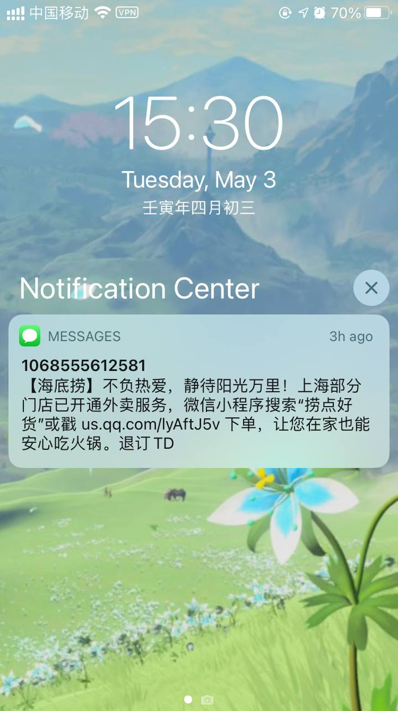
>
> Image description: A text message sent by Haidilao Hot Pot (海底捞火锅) on May 3rd, advertising their hot pot delivery service.
>
> It's Tuesday, May 3, 15:30.
>
> MESSAGES
>
> Sender: 1068555612581
>
> Received: 3h ago
>
> "[Haidilao] Waiting Patiently for the Sunshine Far Away! Delivery service is available from selected Shanghai locations. Visit us.qq.com/lyAftJ5v to order, and let the hot pot come to your doorstep. Reply with 'TD' to unsubscribe."
>
> Image 0: "Waiting Patiently for the Sunshine Far Away"

In early May, I came across several accounts of successful escapes from Shanghai, but none really caught my attention until May 11th, when I read an article like this:

> [Escaping Shanghai? The Latest Departure Manual is Here! (逃离上海？最新离沪手册来了！)](http://telegra.ph/%E9%80%83%E7%A6%BB%E4%B8%8A%E6%B5%B7%E6%9C%80%E6%96%B0%E7%A6%BB%E6%B2%AA%E6%89%8B%E5%86%8C%E6%9D%A5%E4%BA%86-05-11)
>
>  Author: Pragmatist (实用派) Source: Shanghai Artistic Youth (上海文艺青年)

(This link is an archive; the original article has been deleted by the author. Opening it directly only shows text, but images are visible when opened through the Telegram mobile app.)

This article was very detailed and seemed realistic, also matching some information I already knew. I immediately started organizing information based on my own situation, calling for clarifications where details were sparse. During this period, more news of successful escapes from Shanghai appeared online, along with coverage by traditional news media. Each story was tantalizing, but in terms of practical advice, none were as helpful as the article mentioned above. These reports and articles, along with information I gathered myself from neighborhood committees (居委会) and citizen hotlines, made me feel that escaping Shanghai was "feasible, but not entirely so". This kind of ~~being able to erect but not to ejaculate~~, ah-hem, frustratingly incomplete feeling was agonizing. After a two-and-a-half-hour overnight discussion with my supervisor at work, I finally resigned on May 13th to become a full-time scholar of escaping Shanghai.

> 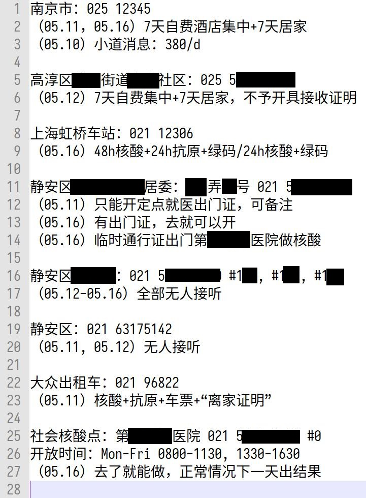
>
> Image description: A list of government agencies or civil organizations, their phone numbers, followed by records of attempted contact, the date, and the outcome.
>
> Image 1: My Collected Information on Escaping Shanghai

### Age of Inflation

May 17th to present[3].

News reports stated that on May 17th, the number of people leaving Shanghai from Hongqiao Station (上海虹桥站) skyrocketed from 1,000 people per day to 7,000. Tickets were hard to get, but they had always been; what's harder was hailing a cab: On May 11th, I tried calling the Dazhong Taxi (大众出租车) hotline 021-96822 to book a car, and the call connected quickly. The person on the line readily said a car could be booked, but at that time I didn't have a train ticket or a pass to go out, so I just asked and then hung up. When I tried again on May 17th, from 11 a.m. to 5:30 p.m., I finally got through once (meanwhile, I received a text message saying "Your voice call charges outside of your monthly plan have exceeded 20 yuan"), but still failed to successfully book a ride. I believe this phenomenon clearly indicates the increase in the number of people trying to escape Shanghai who have managed to get train tickets and neighborhood passes to leave. The number of train tickets is also obviously increasing; now (as of May 23rd), there are about 20 trains per day from Shanghai to Nanjing, and some trains even have immediate availability without the need for waitlisting.

In "Amap" (Gaode Map, 高德地图), when you drag the map to the vicinity of Hongqiao Airport (虹桥机场), you can see a group called "Hongqiao Airport Information Mutual Aid" (虹桥机场信息互助) where various pieces of information are shared, but overall, there are more people asking questions than sharing experiences. As the number of people escaping Shanghai continues to rise, the phychiatric issues some of them face are gradually coming to light...

> 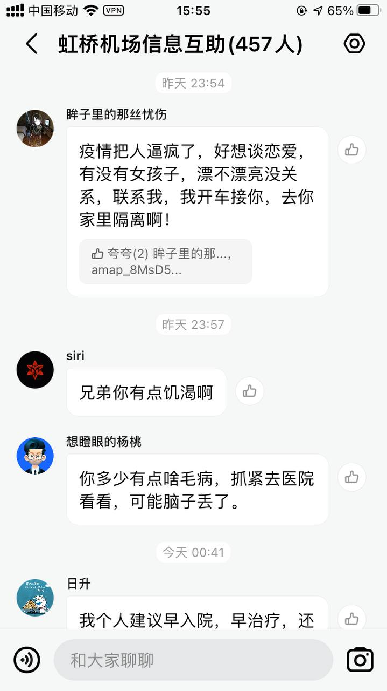
> 
> Image description: A screenshot of the "Hongqiao Airport Information Mutual Aid" group chat where a person said he really wanted to start a relationship and go quarantine together at the (imaginary) girl's place. The other group members were suggesting him to go to a hospital for some mental care.
>
> Image 2: Really want a date, we can quarantine in your home!

> [3] The original Chinese version of this memoir was written up in the end of May, 2022.

### Age of Indeterminacy

Several news reports have cited interviewees mentioning, "The problems encountered today may no longer exist tomorrow." You might not be able to buy a train ticket on May 16th, but then you manage to get one on the 17th; you might not be able to leave your residential area on the 15th, but suddenly you can on the 16th. The night I stayed under the bridge, I heard that people from outside Wuhan, Hubei (湖北武汉) and Jinan, Shandong (山东济南) could get free quarantine there; now it seems the situation has changed again. Regardless, I have already escaped, so naturally, I won't keep track of the practical issues of fleeing Shanghai anymore. A few days ago, I was still sharing my experience with my fellow strugglers in the "Hongqiao Airport Information Mutual Aid" group on Amap, but now I dare not -- who knows if my information is still accurate?

The future is full of uncertainties. Just like the negative PCR test report for station entry must be within 48 hours, please take the latest escape information as the most accurate and it's best to call and ask for yourself.

> 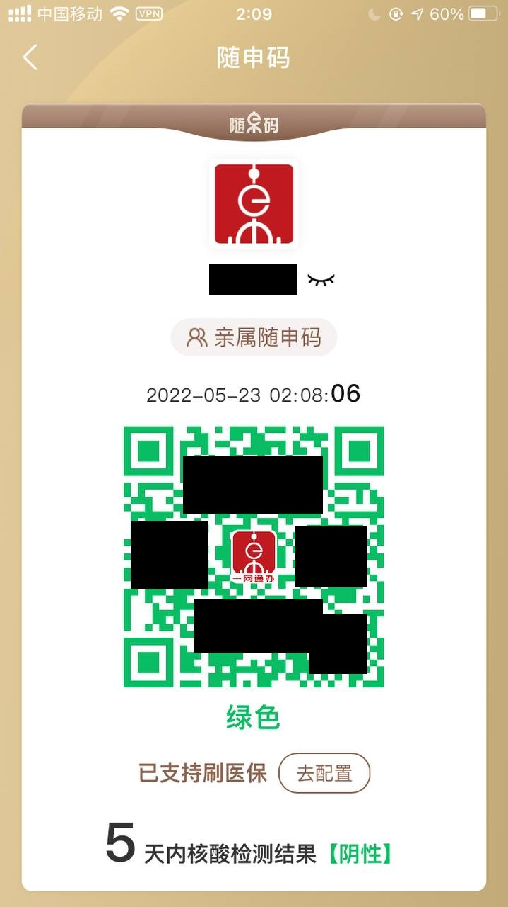
>
> Image description: A screenshot of Suishenma, the "Health Code" used in Shanghai, indicating that the holder has a negative PCR result within 5 days.
>
> Image 3: The "shelf life" of modern humans

## Refugee Documentary

### Before May 18th, Shanghai

> **Shanghai Joke**
>
> During a live online class in a Shanghai elementary school, a teacher told the children: "Don't worry, Shanghai is an international metropolis and a model for epidemic prevention. The whole country is supporting us, and currently, we have ample supplies and good medical security."
>
> The Shanghaiese children below happily exclaimed: "**Yay! I want to go to Shanghai!!**"

#### The Madness for Tickets

Anyone who frequently travels between Shanghai and Nanjing knows that train tickets between the two cities are so accessible that even kindergarten children could buy them. The 380 km/h Beijing-Shanghai high-speed railway (京沪高铁, the fastest high-speed rail in current service), the 300 km/h Shanghai-Nanjing intercity railway (沪宁城际), and the daily, punctually delayed green-skinned express trains together offer more than 100 options each day. However, after the lockdown in Shanghai, your options instantly dropped to two (later recovering to five), and none of these trains start in Shanghai and end in Nanjing, which means you'd face sectional ticket restrictions.

Around May 11th, when I first checked for tickets, within the 5-day advance sale period, the majority of the train seats had already reached the status of a full waitlist (候补) queue (note, not just sold out, but "full waitlist queue", meaning you couldn't even queue for a waitlist if you wanted to). There were a few seats still available for waitlisting, but at that time, I hadn't obtained a pass to leave my residential area, so I didn't make a purchase.

On May 16th, for the second time I checked for tickets, Shanghai Hongqiao station released tickets for May 20th for sale at 1:30 p.m. I was staring at my computer screen for time, at exactly 13:29:59, and the text on my phone screen changed directly from "On sale at 13:30" to

> Business (商务): Waitlist | First Class (一等): [Waitlist](#) | Second Class (二等): [Waitlist](#)

Under such treacherous conditions, I ultimately failed to grab a ticket. Later, my mother and I tried to snap up tickets using Ctrip (携程旅行) and Zhixing Train Tickets (智行火车票), thinking we'd leave it up to fate. The next morning (May 17th), at around 9 a.m., my mother called me, saying she had managed to grab a ticket for May 19th, first class.

> 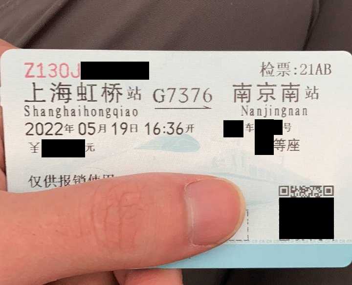
>
> Image description: A train ticket from Shanghai Hongqiao to Nanjing South Railway Station (南京南站), departing at 16:36, May 19th, 2022, First Class seat.
>
> Image 4: Train ticket

Here's my theory: Normally, when people travel between Nanjing and Shanghai, if a train's second-class seats sell out but first-class seats are still available, they would choose a second-class seat on a train departing at a similar time. So there are usually fewer first-class buyers compared to second-class ones; now, as people want to travel from Nanjing to Shanghai, if a train's second-class seats are sold out but first-class seats are still available, they would choose to pay more for the first-class seats, so the number of first-class buyers won't be much less than that of second-class buyers. Given that there are much fewer first-class seats than second-class ones, getting a first-class ticket is not necessarily easier than getting a second-class ticket now. Please analyze whether this theory is correct, and if not, what's wrong with it.

I consider myself lucky, having managed to get a ticket relatively easily, but not everyone is so fortunate. Based on snippets of conversations I overheard on my way to the station and in the waiting hall, many people got their tickets from scalpers (黄牛). I'm not very familiar with the current scalping industry, especially how it operates in the context of real-name enforced electronic tickets (实名制电子客票), but the scalping markups I heard ranged wildly from 300 to 2000 yuan (Zhixing Train Tickets also allows you to pay extra to speed up the ticket snatching process, but the amount isn't as outrageous). A second-class seat from Shanghai to Nanjing costs less than 150 yuan, so the scalpers are making a killing this time.

Others, like two of my fellow refugees who escaped Shanghai at the same time, found that a lot of tickets were suddenly released on the evening of May 17th while browsing on their phones, and they bought them directly. They managed to get tickets on the same train as me, but at a later time, which can't be anything but the victory of patience.

#### Exit Visa

All the guides and reports on escaping Shanghai invariably mention two types of certificates: one called the "Reception Proof" (接收证明), and the other the "Exit Proof" (离沪证明). The former is issued by the neighborhood committee of the destination (hometown), certifying that someone will receive you upon return. The latter is issued by the committee of the departure point (current residence in Shanghai), certifying your intention to leave Shanghai and not return before the end of the lockdown. Some departure point committees require the former before issuing the latter (similar to how an embassy asks for proof of residence in the home country or elsewhere when applying for a foreign visa to reduce the risk of staying illegally upon entry).

Reception Proof is not issued in Nanjing, which is also mentioned in the articles above. When I called the committee, they said it was under the instruction from higher up. As for the Exit Proof, when I first asked the committee on May 11th, it was not available. Their exact words were, "Right now, we can only issue passes for closed-loop transfers to designated hospitals. If you have an emergency and need to leave, we can make a note of it for you, but whether the police will stop you on the road[4] is beyond our control." I guessed they would definitely stop me.

On May 16th, after getting my PCR test in the morning, I called the committee again. This time, they agreed readily: "We have just received the notice; if you want to leave, you can come directly to get the pass." It seemed like there were no restrictions anymore. I didn't rush; only after buying the train ticket on May 17th did I go to the committee. They first asked whether I was driving or using public transportation. When I said I was taking the train, they actually asked if I had already bought the ticket. I don't know if they would still issue it to me if I said no. They also mentioned the Reception Proof for the destination, but when I told them that Nanjing doesn't have this, they didn't care and just said, "As long as someone receives you when you return, it's fine." Then they copied my ID card (身份证) and handed me the pass to fill out.

> 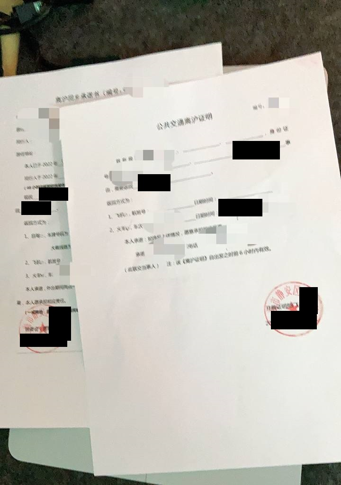
>
> Image description: A photo of two A4-sized printed and sealed documents which I signed to certify my intention to leave Shanghai and not return before the end of lockdown. One titled "Letter of Commitment to Exit from Shanghai for Hometown" (离沪返乡承诺书), and the other titled "Certification of Exit from Shanghai by Public Transport" (公共交通离沪证明).
>
> Image 5: Shanghaiese Exit Visa

There were two forms for the pass, one called "Certification of Exit from Shanghai by Public Transport", which includes name, ID number, reason for travel, destination, train date and time, contact information, and signature. The other is called "Letter of Commitment to Exit from Shanghai for Hometown", which includes name, ID number, contact information, current address, PCR test report date, reason for travel, destination, departure date, mode of transportation, and a declaration stating "I commit to traveling directly to my destination and practice personal protection during the journey. I shall bear the corresponding responsibilities for any adverse consequences", along with a signature. Both proofs are duplicated and stamped by the committee.

It's worth noting that the "Public Transport Exit Certification" states, "This proof is valid starting 6 hours before departure time", but the committee said this is a standard template; in our area, you can leave anytime you want (as long as you don't come back). So indeed, I left the residential area more than 20 hours before my departure time without any hindrance. A fellow escapee from Shanghai told me that her community only issued one of the forms (I don't remember which one, but it was the same as one of the two I received). So I'm not sure about the extent of this "standard template".

As for the effective range of the Exit Proof, I personally think it's until you leave the community. Originally, I thought every checkpoint on the road was checking for this document, but then I realized that each time I was the one who actively showed it to them. Whether they would check if I didn't offer it is debatable. As for the rumor that you need an Exit Proof and Reception Proof to enter the station and board the train at Hongqiao Railway Station, it's purely a rumor. Since I passed the last checkpoint and arrived near Hongqiao Railway Station, I never used these two proofs again.

> [4] At that time in Shanghai, there were police checkpoints at major expressways, district boundaries, entrances and exits of elevated and highways, etc., where passes were checked.

#### Supply and Demand

I previously mentioned the Dazhong Taxi hotline 021-96822, which I found in the "The Latest Departure Manual". It's said that this hotline, opened by Dazhong Taxi Company in early May, is exclusively for those leaving Shanghai. Indeed, when I first called to inquire on May 11th, I was told there were only two destinations available: the train station and the airport. I remember reading from some news source that they had a total of over a hundred taxis for this service, which might have seemed reasonable on May 11th but was obviously insufficient by May 17th. I started calling as soon as I got back from getting my "Exit Proof" from the committee in the morning, and it kept prompting, "All agents are busy, press 1 to continue waiting, or hang up to end the call."

The automated response system of this hotline is the most rigid I've ever encountered (besides those systems that make me speak directly to a robot instead of pressing keys to choose functions). Other systems, when unable to connect to a live agent, either continuously play music while you wait or give you a single notice that "agents are busy" and ask if you want to continue waiting. If you choose yes, they let you keep waiting to music. This hotline, however, was unique, constantly reminding me that "agents are busy" and requiring me to press "1" repeatedly. Sometimes, after pressing "1", it would play some music for a while, but more often it would immediately repeat the busy message. So I spent an afternoon playing a rhythm game pressing "1":

> "All agents are currently busy (1), to continue waiting -- We are transferring you to customer service, please hold... All agents are (1) busy -- We are transferring you to customer service, please hold...(1) All agents -- We are transferring you to customer service, please hold...(1) All agents -- We are transferring you to customer service, please hold...(1) (Music for 20 seconds, my pressing '1' was in vain) All agents are busy (1), to continue waiting -- We are transferring you to customer service, please hold..."

Not only that, but after pressing "1" too many times, the call would get disconnected, and I strongly suspected this reset my place in the queue. During this time, I received a text message indicating I had exceeded 20 yuan in call charges outside my plan, so I quickly topped up my domestic voice package (国内语音加油包) and continued calling until I finally got through after 5 p.m.

> 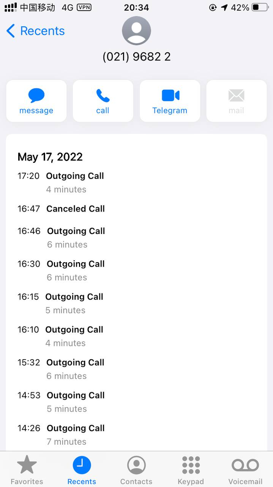
>
> Image 6: The Eternal Wave. 中国移动 = China Mobile.

I gave them my departure point, destination, and the time for May 19th at noon (my train was at 4:30 p.m.), and the person on the other end was far less cheerful than the first time. He cautiously said, "I'll try to book it for you", and then told me that if the booking failed, I would receive a cancellation text within an hour. And indeed, I did. The next day, I called all morning and got through once again. This time he told me that 11 a.m. and 12 p.m. were fully booked, and he would try to book 1 p.m. for me, and if it failed, I would get a cancellation text within an hour. And again, I did.

> 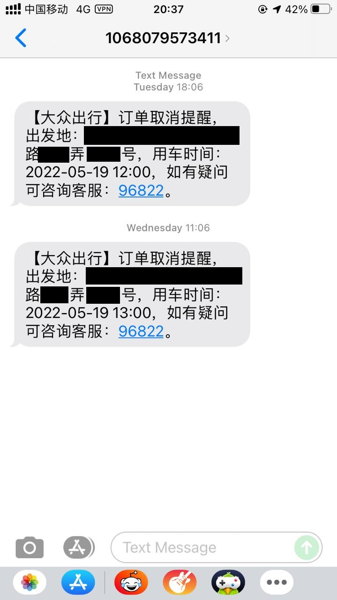
>
> Image description: Two text messages notifying me the cancellation of taxi ride reservations.
>
> Image 7: If you don't dream for gains, you don't suffer from pains.

At this point, I was left with only two choices: to walk or to take an unlicensed taxi (黑车). The option of a bikeshare (共享单车) was immediately ruled out, as I needed to drag a suitcase, and without it, I wouldn't be able to take a single piece of clothing. Walking over 20 kilometers *(Approx. 12 miles)*, less than 25 kilometers *(15 miles)*, Amap said it would take over 4 hours, and considering the actual circumstances of trekking a long distance with luggage, it would take at least seven or eight hours. As for the unlicensed taxis, that's a deeper water. I found a few unlicensed taxi service providers on "58.com" (58同城) Shanghai car service section, Baidu Tieba (百度贴吧) "Shanghai Carpool" (上海拼车) bar, and a few "Weibo" (微博), "Little Red Book" (小红书), and other pages accessible through search engines. The going rates[5] were roughly like this:

> **Swindler 1**:
> 
> Me: Hello, do you have a car from Jing'an District (静安区) to Hongqiao Railway Station on May 19th?
> 
> Other side: Yes.
> 
> Me: What's the price?
> 
> Other side: 2000. *(Approx. 300 U.S. dollars)*
> 
> Me: (Read but didn't reply)

> **Swindler 2**:
> 
> Me: Hello, do you have a car from Jing'an District to Hongqiao Railway Station on May 19th?
> 
> Other side: Yes.
> 
> Me: What's the price?
> 
> Other side: 1000 *(150 USD)* for within 20 kilometers, an additional 120 *(18 USD)* for every ten kilometers beyond that, don't curse at me haha, it's the company's pricing, I'm just customer service.
> 
> Me: What's your company, is it legit?
> 
> Other side: Shanghai XXXXXX company.
> 
> Me: (Checks Tianyancha (天眼查)[6], finds a company with the exact name that is actively operating.)
> 
> Other side: Send me your precise location so I can give you an exact quote.
> 
> Me: (Sends residential area address.)
> 
> Other side: 700 *(105 USD)*, you have to pay in full before I can place your order.
> 
> Me: Full payment?
> 
> Other side: Yes, because previously a lot of people only paid a deposit and didn't pay the rest, so we have no choice, it's also the company's policy. If you don't think it's appropriate, look elsewhere.
> 
> Other side: Needs a PCR test result within 48 hours.
> 
> Me: I got tested this morning, the results aren't out yet, but I'll definitely have a test within 24 hours by the time I take the ride, is that okay?
> 
> Other side: What about your last PCR report?
> 
> Me: It's beyond 48 hours.
> 
> Other side: We require a negative PCR test report within 48 hours when placing the order.
> 
> Me: Ah...

> **Swindler 3**:
> 
> Me: Hello, do you have a car from Jing'an District to Hongqiao Railway Station on May 19th?
> 
> Other side: Tomorrow I only have one trip left, at six in the morning, I can take you along, sharing with others, I'll charge you 800 *(120 USD)*.
> 
> Me: Is there a limit on the number of luggage items?
> 
> Other side: Can't take too much.
> 
> Me: 3 suitcases, each not too big.
> 
> Other side: Definitely can't take 3.
> 
> Me: Ah...

> **Swindler 4**:
> 
> Me: Hello, do you have a car from Jing'an District to Hongqiao Railway Station on May 19th?
> 
> Other side: Yes.
> 
> Me: What's the price?
> 
> Other side: Currently only private hires, for up to three people it's **twelve hundred (1200, *180 USD*)**, more than three people it's **sixty-three thousand (63000, *9300 USD*)**, not expensive, this is the going rate.
> 
> Me: Is tomorrow morning okay?
> 
> Other side: Police are strict during the day, you'd better go early, like one or two in the morning, or three or four, safer that way.
> 
> Me: (So I have to worry about the cops too, is this really reliable...)

After asking a few, each seemed to have their own issues, and I felt it might be better to walk there. It's only over 20 kilometers, surely I could walk it in one night. It's not like there are any gangsters wandering in Shanghai these days, right?

> [5] The regular taxi rate in Shanghai was 20 yuan *(3 USD)* for the first three kilometers, and then 3 *(less than half USD)* for every subsequent kilometer.
>
> [6] Tianyancha is an online service where people can look up company names to figure out whether they are legitimately registered or not, along with other business-related information.

#### On the Eve of Departure

At 5:30 p.m. on May 18th, I finally resolved to walk to Hongqiao Station. Although my PCR test report from the morning had come out by then, I didn't want to deal with the uncertain and costly unlicensed taxis anymore. So I called the committee to confirm that I could leave the community before the 6-hour mark noted on the exit proof, and I started to prepare for my departure.

My luggage consisted of two not-so-large four-wheeled suitcases, a cardboard box, and a backpack. The backpack was filled with my computer, various chargers, charging cables, power banks, and other miscellaneous items, a bag of toiletries, and two thermoses full of water -- it was very heavy. The cardboard box, leftover from a previous computer purchase, held various square-shaped items like computer and phone boxes, the Nintendo Switch dock, computer power brick, hard drive, and a few books. The suitcases were packed with clothes for all seasons (it was winter clothes weather when Shanghai first went into lockdown, and by the time I was leaving, it was too hot not to wear short sleeves during the day). In addition, there were two quilts, two blankets, a thick cotton coat, and several thick wool pants that I couldn't take with me and had to leave at my landlord's place.

I must mention my landlords in Shanghai. I rented a small room in their house and shared the kitchen and bathroom with them. They are a couple in their sixties, nearly seventies, and my feelings towards them are complex. First, I must admit that I never worried about running out of food while living with them; they allowed me to eat anything in the house, and our community was among those that managed supplies quite well, with everything we ordered able to be delivered. At the same time, the landlady's excessive concern caused me serious distress. Previously, she often invited me to dine with them. Back when I was working and leaving early, returning late, it didn't impact me much. But since the lockdown began, I was trapped with nowhere to escape, and the enthusiastic Shanghai auntie never seemed to understand the word "no." After firmly refusing to dine with them and stating I would cook for myself, she began to express dissatisfaction when I didn't eat at meal times. I had to lock myself in my room, quietly sneak into the kitchen late at night when they were asleep, and cook for myself. I never want to hear the phrase "don't be polite" (别客气)[7] again. Sometimes, I truly feel that the most beautiful world would be one where everyone can distinguish between politeness and a genuine refusal.

After notifying the landlords, I cooked my last meal there: two large pork chops and ate two apples and an orange. I tied the plastic bag containing apples and snacks to the handle of one suitcase and used wide tape to attach a pack of tissues to the handle (first taking out the tissues, passing the tape through the tissue packaging, wrapping it around the handle, and then putting the tissues back). I also packed another pair of shoes in a bag and attached it to the handle. I sealed the cardboard box and taped it directly to the handle of the other suitcase. In this way, three pieces of luggage were combined into two, and I could push one with each hand.

I put on my mask, clipped the folder containing the exit proof to one of the suitcases, and said goodbye to the landlords while pushing the two suitcases. The landlady asked when I would return, and I replied, "Of course, when Shanghai lifts the lockdown." She then asked if I would still live there, to which I said no, I would just come back to collect my things. She understood, and we wished each other well, parting at the entrance of the building.

Walking through the community, I saw many suspected committee workers in blue isolation gowns (隔离衣) engaging in group activities (进行群体聚集性活动), colloquially known as cooling off and chatting. They casually chatted with me, asking where my hometown was, whether I had to quarantine upon returning, and if quarantine would cost money, to which I gave brief answers. At the community entrance, I showed the security guard my "exit visa", and he asked me to register my information. It was obvious that the registration form was repurposed from the previous form for people coming to or returning to Shanghai from other places, with "coming" crossed out and "leaving" written in. Probably there was no condition to produce a new departure registration form, as where would you find an open printing shop to do so? Like the Japanese who crossed out the "Showa" era on their stationery to change it to "Reiwa" and continued to use it, it was a makeshift solution -- why need a bike when you can walk (还要啥自行车)? He then checked my ID, train ticket, health code, and PCR report, and had me hold the exit proof while he took a couple of half-body photos. After all this, the security guard indicated that I could leave and raised the barrier for the vehicle lane with a remote control. My phone rang; I opened it to see that a Shanghai virtual streamer (虚拟主播, Vtuber) I followed had sent me a news screenshot titled "Man drags suitcase walking from Shanghai back to Jiangsu". I gave a wry smile. It was just turning 7 p.m., and with a sense of relief mixed with a little excitement, I crossed the point of no return on this journey.

> 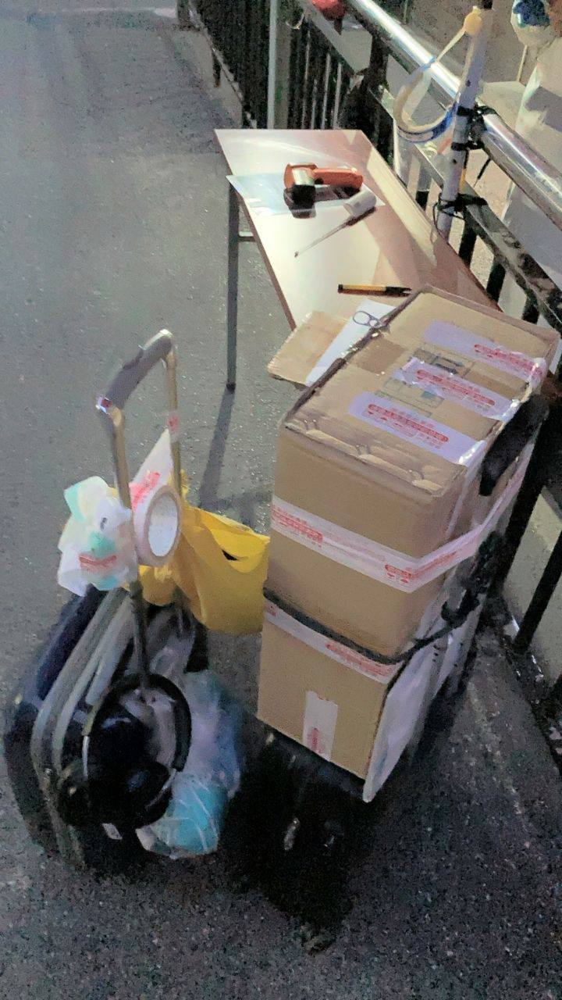
> 
> Image description: A photo of two suitcases standing on the ground, with a cardboard box taped onto one of them.
>
> Image 8: The life and belongings of a Shanghai refugee

> [7] In Chinese culture, the concept of "客气" (keqi, literally "guest-like", or "consider oneself a guest (rather than a family member)") is deeply ingrained and can be roughly translated as politeness, courtesy, or modesty. It often involves a polite refusal of offers or gestures, sometimes multiple times, out of a sense of modesty or not wanting to impose. It's expected that the offerer will insist, and the receiver will eventually accept after a few polite refusals. This ritual dance of offer and refusal shows respect and consideration for each other's feelings.
>
> The landlady's persistent invitations and concern, despite my refusals, reflect this cultural norm. The landlady have perceived my refusals as a form of "客气", expecting that with enough insistence, I would accept her hospitality. However, I was genuinely declining her offer because having grown up in Jiangxi (江西) province where salty and spicy food is the standard, I really could not appreciate the sweetness of Shanghai cuisine she makes every day.
>
> This cultural misunderstanding can lead to discomfort when one's true intentions are not recognized, especially in a cross-generation context where younger people may prefer more straightforward communication modes and the nuances of "客气" may not be universally understood or appreciated.

### Night of May 18th to Morning of May 19th, Shanghai

> **Shanghai Joke**
>
> Shanghai's three big mysteries:
>
> The number of positive cases keeps increasing, yet there are no high-risk areas.
>
> There are no high-risk areas, yet people are not allowed to go out.
>
> People are not allowed to go out, yet the number of positive cases keeps increasing.

#### A Night Parade of a Hundred Demons (Japanese: 百鬼夜行, Hyakki Yagyō)

At 7 p.m., the prime time for nightlife suitable for all ages, the streets of Shanghai were sparsely populated. Those gathered in groups were usually wearing blue isolation gowns, unloading goods from trucks at the entrance of a fresh food store. There were also people on electric bikes and bicycles, all wearing tightly fitted masks and in a hurry. Few were walking like me, but one thing was common: no one spoke, and the silence made it feel like a ghost town.

Occasionally, a small car would pass by me, and I wondered what they were doing and how much they could earn in one night. Turning a corner onto a main road (under the Central Ring Elevated Road 中环高架), trucks, big and small, became the main occupants of the vehicle lanes, though not in large numbers. The traffic lights changed as usual, unaffected by the presence or absence of traffic, faithfully performing their duty as relics of human activity integrated into the natural landscape. I turned on Amap's walking navigation, set my destination, put my phone back in my pocket, and all that was left was the sound of my luggage wheels rolling on the ground.

After a long silence from my phone, I thought it was malfunctioning. I took it out and saw that the screen had changed from "turn left in 300 meters" to "turn left in 100 meters." Indeed, why would it need to say much more for such a distance? Suddenly, I was overwhelmed by an unprecedented sense of loneliness, looking around at the empty streets, but I gritted my teeth and continued. Leaving the main road and turning into a two-lane ordinary road, my mom messaged me, saying it was too late and I should leave at 5 a.m. the next day. I told her I had already left, and what happened later proved my decision was right: if I had left during the day, my journey wouldn't have been this smooth. To my right was a residential area, its gate adorned with a stand for food deliveries, and several electric bikes parked nearby, deliverymen silent. To my left, a Malatang (麻辣烫) hot pot restaurant had resumed delivery service, with six or seven young men in yellow or blue uniforms[8] crowded at the entrance, doing brisk business. Perhaps this was the so-called "vitality of Shanghai" (上海的烟火气) mentioned in some news reports?

Approaching an intersection, the road was blocked with barriers, leaving only a small opening for pedestrians and non-motorized vehicles. I pushed my suitcases through, stood at the empty intersection, and waited two minutes for the traffic light without a car passing by, then crossed the road to continue my journey. Back on the main road, traffic beside me began to pick up, with streams of delivery riders in yellow or blue uniforms zooming past me on electric bikes. Suddenly, a delivery rider resting under a tree to my right struck up a conversation:

> "Bro, where are you heading?"
>
> "Going back to my hometown!"

I replied cheerfully. I was too happy to leave Shanghai.

> "Your hometown? Heading to Hongqiao (station)?"
>
> "Yes, to Hongqiao!"
>
> "Walking there?"
>
> "Yes, walking!"
>
> "Damn, bro, that's fking awesome!"

The rider expressed genuine admiration and then offered, "If you give me 150 *(22 USD)*, I can take you there on my bike."

Would everyone think 150 for an electric bike ride is outrageous? I felt this price fully demonstrated the rider's helpful and altruistic spirit. I asked if he could really take me there, and he confidently assured me he could, as he had a pass. I was still doubtful: having a pass doesn't mean you won't get caught for carrying passengers. But then I thought, even if we got caught, the worst-case scenario would be to continue walking, and his willingness to take me was already a great help. So, I decided to add a tip and pay him 200 *(30 USD)*. The deal was made; he placed one of my suitcases in the delivery box at the back of his bike, and the other was squeezed in front. I sat on the back seat with my backpack, and off we went.

The rider set up the navigation and asked my name, saying the police might ask, and I should just say he was giving me a lift. He also told me his name (referred to as "Brother Yu" (余大哥) hereafter). Speak of the devil, and he shall appear. At the next major intersection, the road was blocked with only a small opening left, and a lone policeman in protective gear leaned against the barrier. We stopped, the policeman checked Brother Yu's electronic pass, then turned to me and asked, "What are you doing?" Brother Yu said, "I'm giving him a lift." Then I showed him my pass, PCR test report, and train ticket. Brother Yu continued, "I'm not charging him, just giving him a lift." The policeman said, "Even not charging is against the rules." But he didn't make it difficult for us, checked my documents, and let us go.

Riding on the bike along the four-lane road, Brother Yu and I chatted all the way. He said he was from Shandong (山东), came to work in Shanghai, and got locked down soon after. Being a delivery rider, he obtained a pass on April 8th to start working again. He mentioned that in the first few days, there were so many orders that he could earn thousands of yuan *(300~ USD)* a day, but recently the business wasn't as good. He said he was just making small earnings, and those who really made money were the group-buy organizers, earning over ten thousand *(1500~ USD)* a day, though it's unknown how much they had to give to the upper level (i.e. authorities colluding with them). As we talked, we approached the second checkpoint.

The second checkpoint was busier, with a small tent and three or four policemen stopping six or seven delivery riders, checking each one's pass. The process was similar to the previous checkpoint. After passing, Brother Yu and I continued our conversation. He said this part of the path was usually via the elevated highway, but now he dared not, and since it was night, there were fewer police on the roads. If it were daytime, he definitely wouldn't dare to take me like this (this is why I said leaving at night was the right choice). In less than half an hour, we arrived at the third checkpoint. There were already others there. I couldn't hear exactly what was happening, but I heard the policeman telling the guy on the shared bicycle, "It's not our problem that your community didn't issue you a certificate..." Perhaps that night there would be one more homeless person on the streets of Shanghai. But who cares, homeless people were everywhere on the streets of Shanghai.

We smoothly passed the third checkpoint, and soon we were only two or three kilometers from Hongqiao Railway Station. Brother Yu dropped me off, and I reassembled my luggage at the roadside. When I took my suitcase out of the delivery box, I saw several towels, a few bottles of drinks, a pound of noodles -- his own food. I paid him the agreed 200 yuan in cash, thanked him again, and watched as he rode off into the distance.

I saw some people sleeping on the roadside with blankets spread out. Following the phone navigation, I reached an intersection and was about to turn when someone on the other side, riding a shared bicycle, shouted that the station was in the other direction. I thanked her and followed, along with a few other aunties. The cyclist told them she came back to guide them, so they wouldn't go the wrong way. We walked a while and finally arrived at the last intersection in front of Hongqiao Railway Station.

> 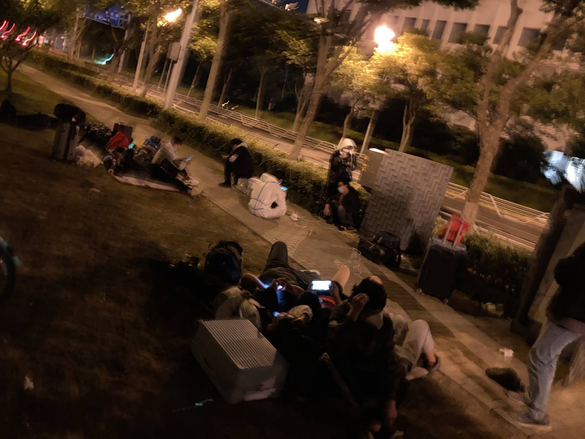
>
> Image description: A photo of an intersection at night, with tens of people sitting or sleeping on the ground.
>
> Image 9: A Glimpse into the Intersection Refugee Camp

> [8] Two big companies, Meituan (美团外卖) and Eleme (饿了么外卖), provide most of the food delivery services in China. The deliverymen usually wear uniforms as required by companies, and ride on their own electric bikes to deliver. Meituan's theme color is yellow, and Eleme's theme color is blue.

#### Dining the Night Breeze and Sleeping Under the Stars

At the intersection, the lady on the bicycle informed us that the way ahead to the station was blocked. It seemed unnecessary for her to lie about it, and seeing that this makeshift camp was quite large, with three or four blankets spread out on the ground and about a dozen people, I decided to rest here for the night. This place was under an overpass, with a sizable green space, although most people didn't venture far into it, congregating instead on the sidewalk and under the bridge. I pushed my luggage onto the green space, ate an apple I brought, drank some water, and then settled under the bridge, arranging my suitcases into a makeshift personal territory.

There were indeed many people here, with various levels of equipment. The most luxurious resident had a tent big enough for two or three people and an electric bike parked outside, looking like the governor of this refugee camp. The next best were those with two blankets -- one on the ground and one to cover themselves, several people sharing a single set, using their luggage as pillows in a messy arrangement. Those slightly worse off had just one blanket on the ground, wearing thick clothes for some rest. The lowest, like me, had nothing and had to sit on their luggage to rest. A fellow refugee next to me gave me a piece of bread, for which I felt ashamed as I had nothing to offer him in return (I needed to save my remaining food for breakfast the next day). He also gave me a roll of garbage bags to lay on the ground to keep off the dirt. After placing a winter jacket over the garbage bag, I could barely lie down.

The brother who gave me the bread booked a train at 8 a.m. the next day and had just arrived that night, like me. Another young man next to us had a ticket for May 21st but came now to try for a ticket for the 20th, which he hadn't yet secured. An uncle with only one blanket from Nantong (南通) had been here for several days without a ticket. As for those on the sidewalk with blankets, I didn't ask about their situations, but judging by their equipment and discussions about ticket-snatching, it was easy to infer they had been living here for some time and would continue to do so. They didn't even have a fixed destination; hearing that Jinan in Shandong had good policies and free quarantine, they suggested to each other, "Let's try for tickets to Jinan!" Wherever they could escape to didn't matter. Perhaps this is the current life situation of some migrant workers.

There were no public toilets, and I read online that all public toilets in Shanghai were closed after the lockdown. I asked around, then headed to the bushes at the back of the green space. The ground was littered with various food wrappers and other trash, uncleaned, and everyone just discreetly avoided it. After taking care of personal needs, I hurried back to my spot and wiped my hands with an alcohol wipe. I wondered where those who had been living here for a long time went to defecate? The thought sent shivers down my spine.

For the first time in my life, I saw a non-medical-worker wearing a white protective suit (防护服). He was a member of a group with two blankets, and at first glance, I thought a police undercover had infiltrated our camp. But a closer look revealed his suit was haphazardly worn. The hood dangled at the back; he wore his own sneakers without shoe covers and didn't wear gloves, playing with his phone and touching things around him. As a former medical worker, this scene made my blood pressure rise, and little did I know I would witness it countless times afterwards.

Communication here was mostly within small groups, with topics inevitably revolving around ticket-snatching, PCR tests, and quarantine. Discussing tickets -- which station to target, which app to use for snatching, where to find scalpers, and how much they were charging -- was a surefire way to heat up the conversation. Among those who had secured tickets, the most crucial information was about a 24-hour PCR testing site about three kilometers west along the main road from the intersection. The young man with the ticket for May 21st would definitely need to redo his test, so I gave him one of my spare antigen test kits.

> 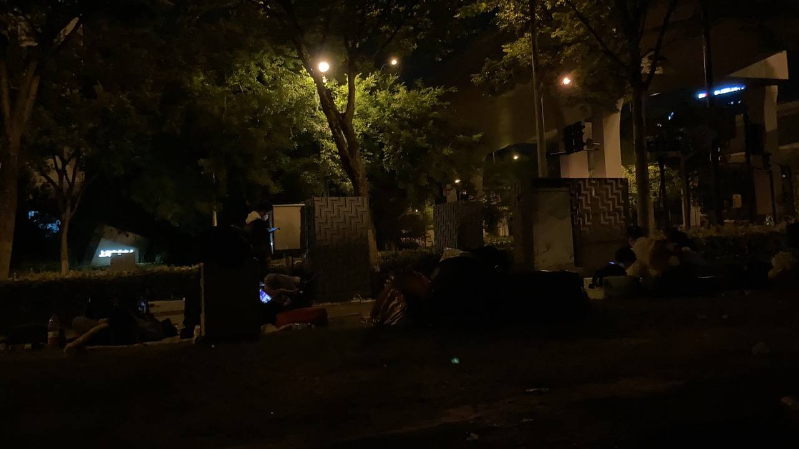
>
> Image description: A closer look at the inhabitants of the camp
>
> Image 10: This Time from the Inside

Unknowingly, the time reached midnight. The night wind grew increasingly chilly, and I covered myself with two more winter clothes, still feeling cold. The uncle from Nantong looked at the sky and said he suspected it might rain tomorrow. Just then, people on the sidewalk hurriedly started packing up their things. At first, I was puzzled, wondering if the rain would really come so soon, only to realize drops were falling on their blankets. It wasn't rain, but water being sprayed from the overpass above. About half an hour later, I saw the source of the "water dragon": a fire truck watering the bushes along the edge of the overpass. Apparently, getting a few migrant workers' blankets wet wasn't a big deal that worths attention, but watering the plants was indispensable.

Sandwiched between the cold night wind and the hard, uneven ground, my sleep quality was poor. At 5 a.m. on May 19th, as the sky began to lighten, I got up to pack my things. I opened my last can of SPAM luncheon meat (198g), used the lid as a spoon to eat half of it, and saved the rest in the bag. The brother with the 8 a.m. train had already left, and I said goodbye to the uncle from Nantong and the young man with the ticket for the 21st, pushing my suitcases. Along the road, I saw another refugee camp across the intersection, smaller and seemingly mostly women (our camp, apart from a couple of aunties with children, was mostly men). People were lying on the roadside or on the grass resting. In less than five minutes, I saw the temporary entrance to Hongqiao Railway Station and the queue forming at the entrance.

#### Speculative Transactions (投机倒把)

The almost stagnant offline physical economy of Shanghai found its second wind in this refugee camp. Shortly after I lay down, a grand procession of electric bikes roared onto the street, stopping at the intersection, followed by calls of vendors. The first batch mainly sold snacks and small eats, leaving shortly after, replaced by a second wave. This second group boasted they had everything anyone could want. Someone asked if they had blankets -- they didn't; someone else inquired about protective suits -- they did have those, new, for either over a hundred or two hundred yuan, I can't recall if anyone bought them. They sold instant noodles and even provided hot water, which I took a bit of without being charged.

This second batch of delivery riders stayed and chatted with the refugees for quite a while, leaving around midnight. After that, there were no more large groups of bikes, just individuals on shared bicycles coming in with small sales. There were sellers of boxed meals from FamilyMart, seemingly uninteresting to most -- I wasn't hungry at the time and didn't ask the price. Then came a cigarette seller with two cartons in his basket; someone bought a pack and exchanged a few smokes with the seller.

At 5 a.m. when I got up, the uncle from Nantong was chatting with a young man on a shared bike. The young man was enthusiastically sharing his money-making strategy: riding out to stock up, traveling ten kilometers back and forth, bringing a case of mineral water (24 bottles) to sell, even asking the uncle if he wanted to buy some. The uncle declined, sharing his own water purchasing experience from a few days ago: small bottles (550ml) were five yuan each, large ones (1.5L) eight to ten yuan[9]. The young man then mentioned a hotel nearby catering to stranded people leaving Shanghai. Asking the police would reveal its location: over a hundred yuan a day, with a shower, and transport directly to the station once you get a ticket. The uncle thought it was a good deal -- a bed to sleep in and a shower -- why not go? The young man replied he wouldn't, as he could make some money selling water outside, then continued to pitch his product to the uncle.

On my way to the station entrance, I saw people with cases of 24 bottles of water on their bike baskets (not inside, as it wouldn't fit) riding at quite a speed. I was curious how they maintained balance, perhaps just natural strength.

> [9] The regular prices for drinking water were 2 yuan for small bottles and 4 or 5 for large ones.

#### The Legend of Electric Monkeys

The most surprising aspect of this refugee camp was their access to AC220V electricity.

When I first lay down in my spot, I saw people outside watching live streams of "Arena of Valor" (王者荣耀) on their phones, engrossed. I wondered how they could afford such a power-draining activity. Later, I noticed many people leaning against electrical boxes by the road, with a wire extending from inside. Upon closer inspection, there were numerous power strips on the ground, with around 20 phone chargers in total. When the uncle couldn't find a MicroUSB cable, I plugged my old phone's charger into my laptop charger for him.

> 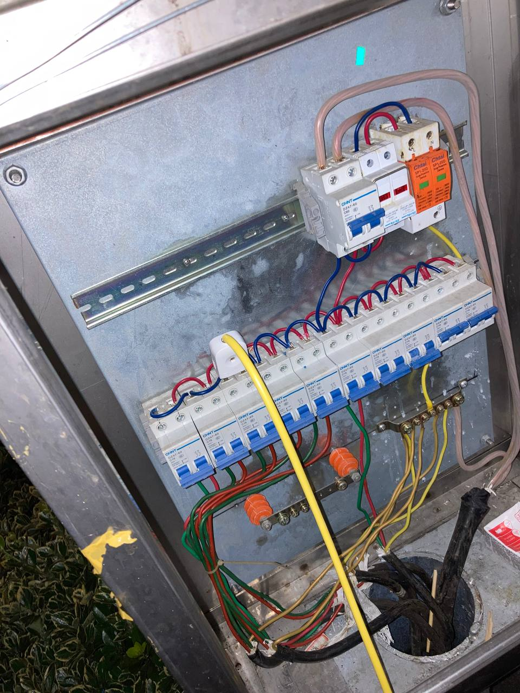
>
> Image description: A photo of a breaker panel, with a power cord temporarily attached to it.
>
> Image 11: Electricity Theft Gang's Core Technology

Inside the box were several circuit breakers with a plug directly connected, which led to a power strip that became the lifeblood of the entire camp. It looked simple, but it was a live electrical operation, and I strongly suspected some experienced electricians were among the early arrivals. I certainly wouldn't dare to do such a thing. I didn't bother to go there due to the distance and mainly used my power bank to charge my phone. When the watering truck sprayed above, although far away, I was still apprehensive. Fortunately, those exposed power strips didn't seem to get wet.

At 5:20 a.m., a young man leaning by the electrical box appeared to be wrapping up. Around 5:25 a.m., he opened the box, unplugged the plug, and coiled the wire, stashing it somewhere unknown. With that, the power supply was cut off, and although it was fully light outside, we lost the light of human civilization.

### May 19th, Shanghai

> **Shanghai Joke**
>
>    Personally, I have a fairly positive attitude towards Shanghai's epidemic prevention work. I think everything about Shanghai's epidemic policies is good, **except for the fact that I am in Shanghai**.

#### Internal Competition (内卷竞争)

At 5:30 a.m., when I reached the end of the queue to enter Hongqiao Station, it was already around fifty meters long. I saw more people in protective suits, but no staff in sight. The sky grew darker, and a light rain started to fall. Those in line didn't move or use umbrellas, acting as if the rain didn't exist. Luckily, it was light and stopped after a minute or two, which in retrospect might have been the watering trucks diligently at work again. I intended to join the end of the queue, but then heard over a loudspeaker: "Those with trains after 11 a.m., don't queue up now; this batch won't let you in. Those before 11 a.m., queue up first!" So, I obediently moved aside, and after speaking with someone already resting by the road who said he had a train at noon, I decided not to rush and sat down on a shared bike to doze off.

> 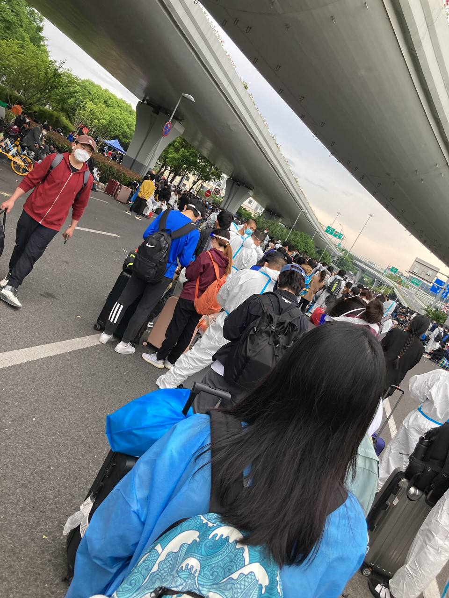
>
> Image description: A photo of the queue of people seeking entrance to Hongqiao station.
>
> Image 12: The "Rainbow Bridge" to Hongqiao [10]

There were also refugees sitting by the roadside. Across the greenbelt was a large green area, deep and with people coming in and out -- probably for urinating. From afar, a woman's shrill cries broke the silence. I couldn't make out her words, but she probably had her escape plan from Shanghai disrupted -- perhaps missed her train, had expired PCR tests, or even mistakenly read the date. A man in the queue quietly commented, "What's the use of crying now." I don't want to become a man who likes to say "What's the use of crying."

The traffic began to pick up. Cars drove onto the ramp behind us, large buses dropped off passengers in blue isolation gowns at the end of the road, and a street sweeper forced refugees resting by the road to get up and move. Buses with screens off and a "Pandemic Support Vehicle" (防疫保障车) sign on the windshield drove out from the entrance we were queuing for, with loudspeaker-wielding staff urging people to make way. I later learned these buses were coming from the station entrance. Every time a bus came out, the queue had to reorganize, creating space for those at the back to move forward, giving false hope to the unaware at the end of the line. Eventually, after frequent adjustments and rumors from the front about not letting people in until 8 or 9 a.m., those of us resting by the roadside settled down and stopped following the queue's movements.

The queue started moving again, this time seeming different. The flow of people continued for more than half a minute without stopping, so I pushed my luggage and followed. I faintly heard the loudspeaker announce, "Those with trains before 11 a.m. first, others wait here!" Unfazed, people around me didn't seem to care, and I doubted they all had trains before 11 a.m., plus the guy next to me with the noon train was also walking. I ignored it and kept going. Reaching the intersection in about five minutes, the announcement changed to "Just show your ticket to enter, anyone with a ticket can go in", no longer mentioning the 11 a.m. cutoff. Occasional reminders included, "Check if your PCR test is within 48 hours. We just need a ticket here, they will check your test upstairs", and "Make sure your ticket is for Shanghai Hongqiao Station, not Shanghai Station[11]!" People hurriedly checked their phones for tickets and tests, with some instructing others on how to upload a 24-hour antigen test. "I have two, take one and go scan", one woman said, offering her companion two already completed negative antigen test kits -- the authenticity of antigen tests didn't seem a concern.

Nearing the checkpoint, I thought about the many people still behind me, and since my train wasn't until the afternoon, I didn't rush and sat down by the roadside to watch the line move. A man in a red vest, likely a staff member (certainly not a passenger), started mocking the crowd: "You people lack experience, crowding like this. If there's one positive case, you'll all be close contacts~" I thought about the long journey everyone had made to get here, each with a PCR test within 48 hours. Besides, if there really was an Omicron positive case, being two meters apart wouldn't matter, as we'd all be close contacts on the train anyway. The man, wearing a plastic Sun Wukong (孙悟空) mask without a proper medical mask underneath, squeezed into the queue with an air of "🙌NO ONE👐UNDERSTANDS☝PANDEMIC👌BETTER THAN ME", would be the first close contact if there were a positive case. What a retard.

Before 9:30 a.m., the four-hour-long queue was almost cleared, and the checkpoint's processing speed balanced with the influx of new arrivals at the end. I opened my train ticket on my phone, ready to go in. The Sun Wukong character continued his pontifications: "You didn't have to queue at all, making a mess of things~" I couldn't understand if this baboon lived his life assuming everyone could be rational under any life-threatening circumstance. I followed the crowd uphill, one of my suitcases too heavy to push and had to be pulled, which was very strenuous. I had to stop frequently to switch hands, during which the other suitcase would fall over, and I had to pick it up again. At some point, I realized a part of my right thumb's nail had chipped off. I smoothed the sharp edge on my clothes and pretended it wasn't there. As we walked, a "Pandemic Support" truck drove by on the main road, filled with about twelve or thirteen rural-looking people, young and old, who must have spent a lot to secure that ride.

> [10] "Hongqiao" literally translates to "Rainbow Bridge".
>
> [11] There are several different railway stations named after the city, including Shanghai Railway Station (上海站), Shanghai South Railway Station (上海南站), Shanghai West Railway Station (上海西站), and Shanghai Hongqiao Railway Station.

#### The Amnesiac Slope

After traversing a long ascending ramp, I, along with the crowd, finally arrived on a more level overpass. Here, we merged onto the main road, at the same elevation as the entrance to Hongqiao Station. Various "Pandemic Support" vehicles of all sizes constantly passed by in the opposite lane, all coming from the station entrance, having dropped off passengers. We occupied all the space on this stretch of the road, forming three lines of bustling crowds.

People in "Minhang (闵行) Police" protective suits with loudspeakers came to organize us, instructing us to form two lines. A polite couple beside me let me go ahead. Calling them a "couple" might not be accurate, as from their conversation, it seemed they had just met while waiting for the train and decided to join up as they were heading to the same destination. The loudspeaker continued, reminding us to check our PCR test reports, and those over 48 hours needed to go back down for retesting. We slowly moved forward to the first checkpoint, with only two lanes, hence the instruction to form two lines. This checkpoint checked our health codes, mainly for the 48-hour PCR test proof. Another checkpoint followed, where we had to show our train tickets.

We had walked from under the bridge, with no pedestrian detours (all were overpasses), following this single path. I didn't understand why the same checks from below were repeated above, but since they required it, we complied. After these two checkpoints, the staff in protective suits checking the documents seemed to have changed from Minhang Police to possibly railway staff (not sure). Another check for the 48-hour PCR test followed. A sign indicated that those with PCR reports between 24 and 48 hours needed an additional antigen report. Several people were seen running to the roadside to conduct their own antigen tests, but after I showed my 48-hour PCR report, I was allowed through without needing to show my antigen report, which I didn't understand.

After the final ticket checkpoint, I had completed the overpass stretch and arrived at the drop-off area before the station entrance. Many people were resting, either sitting by the roadside or on their luggage. There were three or four queues at the entrance, not very long, about ten meters or so, with new people continuously joining the end. From here, I could see a long line of various vehicles on the opposite roadway: cars, buses, and trucks. They drove up to the station entrance, perfectly dropping off passengers so they could directly join the end of the queue, then drove out along the same overpass we had walked up.

> 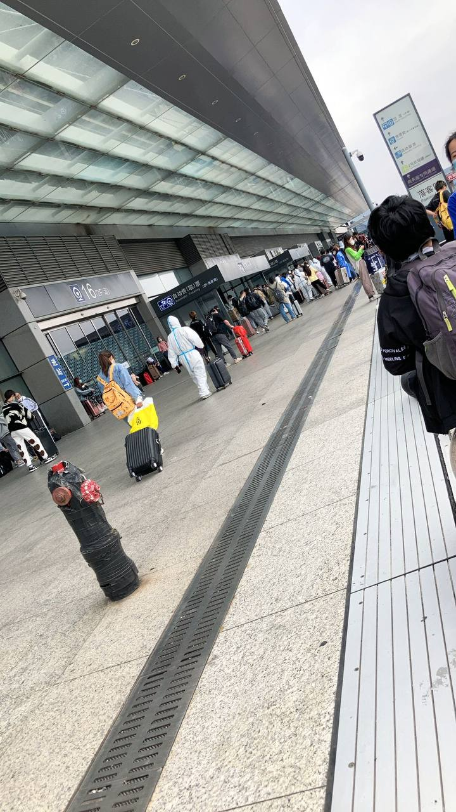
>
> Image description: A photo of the entrance to the railway station.
>
> Image 13: The Most Shanghai-like Place in Shanghai

I rested by the roadside for a while, then joined the queue for the station. All the ticket vending machines outside were off, and through the glass, I could see a room piled with sanitation equipment and staff inside without masks. The staff in front of this queue had "Special Duty" (特勤) on their backs and were checking the "Suishenma" green code[12], using a phone to scan it instead of just looking at it. The phone beeped "verification passed", and I was allowed to pass. They didn't ask about my 24-hour antigen test -- maybe they could access my self-reported antigen test within 24 hours from the "Yi Ce Da" (疫测达) [13] database linked to the "Suishenma"? I wasn't sure, but if not, my 24-hour antigen negative report was unused from start to end. (Shanghai's policy in the 12306 app stated that **both** PCR and antigen test results could be checked on the "Suishenma".)

After this checkpoint, the process was the same as usual for boarding a train: ID check, security screening, and entering the waiting hall. No one cared anymore about my exit proof, 48-hour PCR negative report, 24-hour antigen negative report, or health code green status.

> [12] The health code is a QR code colored green, yellow, or red, where green means lowest risk and red means highest risk. Color itself is easy to forge, but the QR code content is cryptographically protected so that only specialized devices used by government agents can decode the data, hindering forgery.
>
> [13] "Yi Ce Da", literally "Epide-metrologist", is a WeChat mini-program used for uploading and displaying antigen test results, as required by the entrance policy at Shanghai Hongqiao Station at that time.

#### The Fashion Capital

The railway station at Hongqiao are not like those in other parts of China. It have a round counter in the center, where staff members in uniforms sit within. When passengers come into the hall after the checkpoint they buy a bottle of soda; it cost one yuan twenty years ago, but now it costs five. Standing beside the counter, they drink it chilled, and relax. Another five will buy a pack of crackers or chips, to go with the soda; while for forty you can buy a hot lunch box...[14] but let's be serious now.

In all seriousness, the interior of Hongqiao Railway Station might be one of the most "Shanghai-like" places in Shanghai. The entire waiting hall was filled with people, with only about half the seats occupied, not so much due to a focus on protection but because everyone preferred to place their luggage on the adjacent seat. Overall, apart from the closed shops and restaurants, the absence of the incessant ticket checking announcements, most trains displayed on the big screen as cancelled, the lack of conversation, occasional people sleeping on the floor, and the ubiquitous presence of people in protective suits, it was just like any other day at Shanghai Hongqiao Station. I rested near the Lei Feng Service Station (雷锋服务站), eating my remaining half-can of SPAM. I asked a staff member where I could get water, and she directed me to the back of gate 20A. I knew about that place -- to the north was a ticket office and to the south was an "intelligent" toilet with electronic display of vacancies. Near the toilet was a water fountain, a rare presence in China, disguised as a washbasin, and far more common a boiler room. I had been there multiple times when I saw off my beloved one at this station, but I was worried because any facility could shut down without notice during the outbreak.

I slowly wheeled my luggage there, passing a few working and broken beverage vending machines, and people lying on the ground with blankets. The water fountain wasn't working, but the boiler room next to it had both hot and cold water. I filled my bottle and returned to the center of the waiting hall. Looking around, I saw people in protective suits everywhere (at this point, I thought of the term "Fang Hu Fu" (防沪服, pronounced the same way as 防护服 protective suit) -- "Anti-Shanghai Suit", which made me laugh, considering the situation), but few wore them properly. Most just wore the suit, with their hands bare, touching their phones, luggage, and faces. Occasionally, I saw a girl with gloves and shoe covers, but her protective suit's hood was off, with her hair tied in a ponytail making close contact with (密接) the suit. There was a couple without shoe covers or hoods, not even wearing gloves, sleeves rolled up, holding hands, and kissing through their masks. One man, probably too hot, had rolled down his protective suit to his waist, just wearing the pants part, the upper part hanging down from waist as it was a one-piece suit. The only person wearing the suit correctly was a young lady in the Lei Feng Service Station, even the staff selling goods on carts weren't in protective gear but in ordinary railway uniforms, just wearing masks. My medical background makes me see protection as an all-or-nothing matter, i.e. if there is one leakage it means you are not protected at all, so I couldn't quite accept their way of wearing the suits. Were these improperly worn protective suits for actual protection, or just a fashion statement?

> 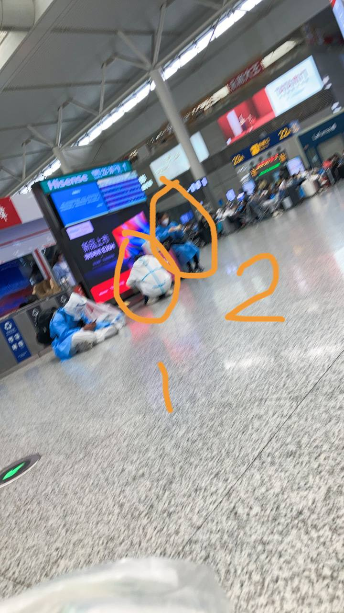
>
> Image description: A photo of three people wearing different protective outfits. The person marked with number 1 was wearing what we typically call a "protective suit", number 2 being "isolation gown". The leftmost person, wearing both at the same time, can be called a "protection maniac".
>
> Image 14: An Illustrated Guide to the "Anti-Shanghai Suit"

I slept on my luggage for half an hour, waking up to find a long queue formed next to me, with a train soon starting ticket checks. I moved to a corner to continue sleeping, but hunger got the better of me, so I stopped a staff member pushing a cart to ask if there was any food for sale. She opened the cart's storage space below and took out a box of hot packed lunch. I paid 40 yuan [15] via Alipay and returned to my corner with the meal. It took me two minutes just to tear open the plastic film halfway on the box, but I was too hungry to bother about it and started eating.

> 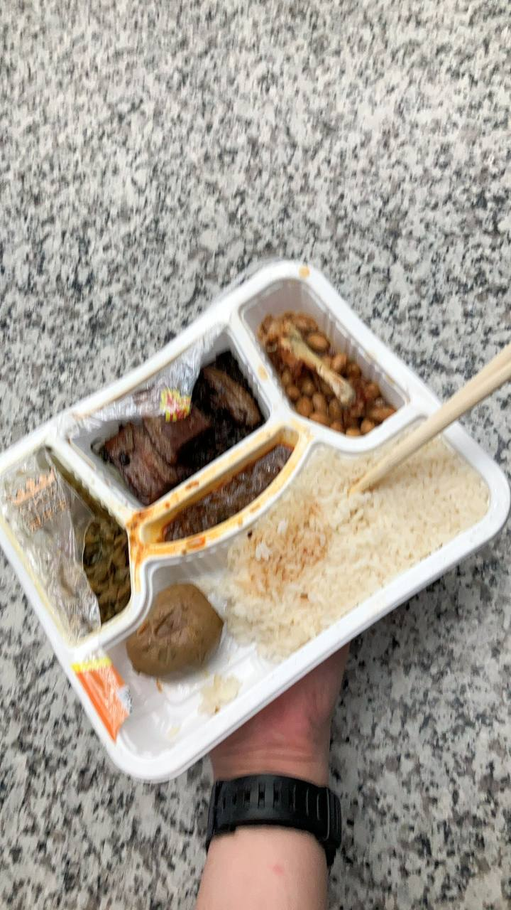
>
> Image description: A photo of a box of Mei Cai Kou Rou Rice (梅菜扣肉饭, rice with seasoned preserved vegetables and pork belly)
>
> Image 15: A 40 Yuan Lunchbox

It was Mei Cai Kou Rou rice, with sides of beans cooked with chicken wings, salt pickles, and a tea boiled egg. The dish had plenty of meat, salty and spicy, just as I like, though lacking fresh vegetables. Overall, I was satisfied, except for the price. But considering the outrageously high regular price of high-speed train meals, especially ones with so much meat, the price was expected. With food prices skyrocketing outside, the steady prices in the station might even be seen as reasonable.

After eating, I threw away the trash and, unable to hold it anymore, went to the restroom. It was then I realized I had never been to this restroom alone; there was always someone to watch my luggage. Not feeling secure leaving it outside, I had to squeeze my suitcases into the toilet cubicle. After returning from the restroom and preparing to sleep again, I received a call from my hometown community, asking about my personal situation, like why and when I went to Shanghai and why I was returning. They confirmed my birthplace and registered residence, as they didn't match my ID number prefix[16], and said they would write a report for the authorities. They informed me someone would pick me up at the station, but it might take a long time due to the need to segregate people. I didn't take the "long time" seriously. After the call, I went back to sleep in the corner, and soon it was time for my train, so I joined the queue.

The ticket check was usual, except for the absence of loudspeaker-wielding staff, and the platform scene was no different from normal times. I queued at my carriage's waiting point. The train stopped a few meters off, causing the crowd to rush forward, abandoning any semblance of a queue. On board, I stored my backpack and one suitcase on the luggage rack, with no space left for the other, which I placed in front of my seat. Luckily, the first-class seat tables were not behind the seats but on the armrests, so it wasn't an inconvenience. I settled in, pulled down the table, drank water, charged my phone, and the train soon started moving.

> [14] Parody of "Kong Yiji" (孔乙己), written by Lu Xun (鲁迅), March 1919.
>
> [15] The regular price of a similar meal outside the railway system varies between 10 and 30 yuan.
>
> [16] Chinese ID number prefix reflects the administrative region where a person applied for an ID number for the first time in his life, and will not change upon a change of registered residence address.

#### No News in Shanghai

The train, after picking up passengers in Shanghai, only allowed disembarkation at subsequent stops (Suzhou 苏州, Wuxi 无锡, Nanjing 南京, Hefei 合肥), with no new passengers boarding. Initially, a few people made phone calls, some to reassure their families, others inquiring about policies with their communities. I overheard someone whose family was in Wuxi; even as the train had started, their local community couldn't clarify where they would be quarantined or if anyone would pick them up. After departure, there was little conversation, no sound from phones or speakers, and no children making noise (as there were seemingly no children onboard). Most passengers, weary, rested in their seats. Occasionally, attendants passed by selling meals, wearing masks and face shields but no protective suits. It might be my misconception, but I recall it's normal on high-speed trains for meal carts to pass through a carriage with no buyers. However, it seemed there were more buyers than usual on this train.

> 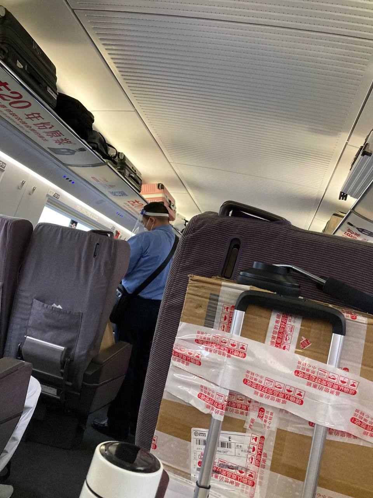
>
> Image description: A photo of a train attendant processing a ticket extension for a passenger intending to travel to Hefei with only a ticket to Nanjing. All attendants wore masks and face shields but no protective suits.
>
> Image 16: Ticket Extension on the Train

> "Ticket extension, from Nanjing to Hefei."

> "Anyone else needing to extend their ticket?"

> "Meal boxes for sale, anyone?"

> "No more beef, that was the last box. I'll bring you shrimp instead, same price."

> "Next stop: Nanjing South Railway Station."

Apart from these interactions, there is nothing new to report about the train, much like every other sunny day, tree, gate, and child locked home in Shanghai.

### May 19th, Nanjing

> **Epidemic Joke**
>
> Civil servant exam question:
>
> You are a grassroots epidemic prevention worker. The higher-ups have notified that people from other provinces should be advised to return. At this moment, a person from another province arrives, holding a 48-hour PCR test report in his left hand and a national regulation document prohibiting excessive epidemic prevention measures in his right hand, wearing a camera on his chest and live streaming. He tells you that national regulations allow free movement for those from non-high-risk areas with a 48-hour PCR negative test report and demands passage. You call your leader for instructions, and the leader tells you to handle it as you see fit. What would you do?
>
> Answer: **Persuade him to return, keep persuading, until it's been more than 48 hours.**

#### The Initiation into the Camp

Dear Nanjing! Finally, I am back in your embrace.

At 6:30 p.m., the train arrived on time at Nanjing South Railway Station. It was dark and deserted, a stark contrast to the usual bustling scene of passengers and high-speed trains on other platforms. All I could see were the passengers from my train forming a line, along with station staff in protective suits loudly directing us with megaphones. "Those without large luggage, take the stairs," they said, but in reality, almost everyone had significant luggage. An elderly lady, indeed without large luggage, was herself sitting in one -- a wheelchair, pushed by her daughter. They tried to use the elevator, which was not operational, and had to seek assistance from the staff.

After descending the escalator, pushing my luggage, I encountered six or seven long queues. No one seemed to know what was happening ahead. Some passengers asked the staff in a nearby kiosk, who replied that it was not his responsibility. I could faintly hear names being called over the loudspeakers and saw passengers from another platform also forming long lines. Sometimes they shouted, "Those with a transfer before 8 p.m., come directly to the front!" Maybe they would be provided expedited services, who knows.

The scenes reminded me of the opening of the movie "Escape from Sobibor" we watched in middle school history class. Like in the movie, we disembarked the train, clueless about our future. I've forgotten the plot, but I vividly remember the Nazi officer's first words: "Welcome to Sobibor. This is a labor camp. The Bible says labor purifies the soul, so in that sense, we are your benefactors." Fast forward to 2022, and this would be modified to align with recent expert opinions: "Moderate hunger prolongs life." So, in a way, the committees and properties that severed logistics are benefactors to the residents of Shanghai.

The queue moved slowly, and no one had a clear idea of what was happening. Finally, when it was my turn, a staff member in protective clothing checked my ID and phone number and asked my destination. I said Nanjing Gaochun (高淳). He noted it down, carelessly **placing my ID on the table**, which already had *3n+1* IDs laid out in rows (mine was the *3n+2*nd one, where *n* is a positive integer greater than or equal to 4). I was directed to wait in another queue, which was gradually being called upon for further instructions. The atmosphere was tense and surreal, to the point where **I wouldn't have been surprised to receive a towel and soap for a "shower"**. I was instructed on where to queue, other people following. Nobody told me what was happening.

While I was queuing, I received a call from someone assigned by the Gaochun District to pick me up, asking where I was. I informed them that I hadn't left yet, to which they replied, "No wonder I couldn't find your ID". Names were being called one by one, and as each person responded, they were formed into a queue. Once a group of ten was assembled, they were led out, with one staff member leading and another "escorting from behind" (as described by the staff), exiting through a ticket checking gate kept open, with their destination unknown. Occasionally, there were groups smaller than ten, consisting of children without IDs or foreign nationals. Foreign nationals could walk independently, but children had to be accompanied by a parent, thankfully not separating them from their families. The process of calling out names was not smooth; some names announced in this area corresponded to people queuing under another platform, necessitating them to walk a longer distance to join. The staff calling out names seemed to struggle with uncommon Chinese characters, mispronouncing several names until another staff member in protective gear assisted them. As more individuals after me were called and left, the area gradually emptied until only twenty to thirty people remained. Finally, my name was called. I moved to the end of the queue and soon started moving towards the ticket checking gate, still unclear about what was actually happening.

The queue moved slowly, and after just a few steps past the ticket checking gate, it halted. Ahead, I could vaguely see shadows in a designated area, engaged in a group activity. The path was enclosed by iron railings. To the left, a sign read "Special Channel for People Coming from Shanghai to Nanjing", and to the right, another sign marked "Channel for People Without PCR Report". Announcements from loudspeakers at other exit gates instructed passengers to show their Jiangsu Health Code (苏康码) and a PCR test report taken within 48 hours. Those without it were directed to the "Channel for People Without PCR Report" for on-site testing. Beside us, tall columns were adorned with real estate and tourism advertisements. How ironic, real estate and tourism (laughs). We stood there for about five minutes, with no one explaining what was happening.

After a few minutes, our line slowly traversed the area where the group activities were happening, reaching deeper into that section. To our right was a group of visibly agitated individuals, likely those who had arrived from other exits, from low-risk areas but without a 48-hour PCR test report. They seemed to have been waiting for quite a while (about an hour), persistently questioning the staff about when they could finish the process. On the left, several people in protective gear sat behind desks illuminated by LED lamps, apparently handling some paperwork. A sign nearby stated, "No PCR Test Service Here". Upon reaching this area, staff guided us to join one of several lines. They instructed those heading to Nanjing region to join the line on the far side, while others transferring to different destinations were directed to different queues. I joined the one on the far side. The line moved very slowly; every couple of minutes, only a few people would advance to converse with the staff at the desks, not knowing what was happening.

Adjacent to us were two lines for passengers transferring to other trains. A staff member rushed over and inquired about the name of the first person in the line on our right. He then searched through files and boxes at a desk for a while, only to return and report, "I can't find your ID card". He then asked the name of the first person in the line on our left and quickly found that ID card, allowing that line to proceed first, which visibly upset the people in the other line. I realized then that the IDs collected earlier were for identifying which group belonged to which line, based on the name of the first person in each group. I wondered if there might be a more direct and efficient way to manage this, or if this method was actually the simplest. As I pondered this, I faintly heard someone calling my name. Looking up, I realized it was indeed my name being called, so I quickly approached the desk from where the call came. The person there said, "I tried calling you, but you didn't answer." I hadn't noticed my phone ringing, but I recognized this person as the one sent by Gaochun District to pick me up. I signed my name on a form, and the person picking me up also signed, noting Gaochun as my destination. He took my ID card and led me to a corner in the deeper part of the area, where a man and a woman were already waiting, seated on their luggage. I still had no idea what was happening for the rest of the people.

#### Bonded transportation

After guiding me to a corner, the person who came to pick me up had me fill out two forms, inquired about the community of my residence, took pictures of my ID card, Jiangsu Health Code, and Travel History Card (行程卡)[17], and then led me along with the other man and woman, three of us in total, out of the station hall to find the car sent by Gaochun District. While I was filling out the forms, the woman noticed my exit permits from Shanghai clamped on my luggage. She pointed it out to her husband, saying, "Look, his exit permit is like this." I showed them my other exit permit, and she remarked, "We have this one too," indicating that I had one more exit permit than they did.

We walked a moderate distance to a seven-seater van parked in a corner. The staff member first opened the trunk for us to put our luggage in, then had us scan a QR code on the car door (possibly the so-called "place code"; after scanning, my phone screen displayed "Location: vehicle plate number Su A XXXXX, located in Gaochun District, Nanjing City"). After scanning, he took a photo of our phone screens with his device. He asked the couple to sit together in the last row of the seven-seater, and I took a seat on the left side of the middle row, only to discover another passenger, a middle-aged man, already seated on the right.

Inside the van, the driver's and passenger's seats were completely separated from the back seat by a dirt-yellow board (I'm unsure of the material, but the color matched the typical dirt-yellow used in vehicle interiors). It was secured with lots of tape, likely constituting what is known as "closed-loop transport". We couldn't hear any sound from the driver's seat (or perhaps they weren't making any noise) and were left to chat among ourselves. Other than that, the van was just like any ordinary seven-seater. We traveled on the highway, and I didn't pay attention to how long we were on the road, but as we chatted, the scenery outside the window gradually became familiar.

The van stopped at the gate of a yard, next to a sign that read "Epidemic Prevention Area, Do Not Approach". My fellow travelers told me our destination was the "Gaochun Development Zone Employee Apartments" (高淳开发区员工公寓). The driver communicated with the security guard at the gate. Perhaps due to some miscommunication earlier, the guard was hesitant and used a walkie-talkie to consult with a superior, who instructed to "let them in". The driver then handed each of us a new mask before closing the door and driving into the yard.

> [17] Communications Big Data Travel History Card (通信大数据行程卡), often abbreviated as Travel History Card, is a mobile phone service which extracts and certifies your travel history based on the signal stations your cellphone have connected.

#### Three Shanghais in four pairs of eyes

During the journey from Nanjing South Railway Station back to Gaochun, I had the first opportunity for an in-depth conversation with fellow Shanghai escapees. Before boarding the van, the woman asked me how I got to Hongqiao, and I mentioned walking and taking an electric bike ride. She shared that she and her husband traveled from Pudong (浦东), using a 15 yuan "security public transport" (保障公交), a concept I was unfamiliar with. They initially walked 5 kilometers from their home, dragging their suitcases (my actual walking distance with luggage to Hongqiao station was about 4.5 kilometers, so they walked even further), reached a station, and then took a bus directly to Hongqiao. She also asked why I didn't call a taxi, and I had to explain that it was simply impossible to book one. Once on the train, the stark disparities in living conditions in Shanghai during the lockdown became even more evident.

The gentleman seated to my right was a typical aristocrat of lockdown. Employed for over twenty years at the Shanghai headquarters of RT-Mart (大润发), he led a life of extreme luxury during the lockdown. Their dormitory, canteen, bathhouse, and office area were all in one building. His daily routine consisted of going downstairs for meals, working, and then returning upstairs to sleep. They never ran out of supplies, and the canteen offered a variety of dishes. Foods that others struggled to obtain outside were easily accessible in their canteen -- what couldn't RT-Mart provide in Shanghai? Their COVID tests were conducted by street officials who came to their gate, and they continued working after testing. He wasn't even planning to escape Shanghai but was going on a business trip after "deasterisking[18]". His train ticket was purchased by the company, and the car to the station was also provided by them. Completing a 14-day quarantine out of Shanghai before heading to an RT-Mart branch elsewhere for research, he remarked, "Otherwise, I wouldn’t have bothered coming out."

In contrast, the couple had a far different experience before leaving. They lived in a Pudong apartment complex, enduring all imaginable and unimaginable hardships of the lockdown. They had secured jobs in Nanjing and planned to move by the end of March, buying only a week's worth of groceries. Unexpectedly trapped in Shanghai for two months, they lived on one meal a day: "Now I understand why people ate tree bark during the famine in the 1950s. When you're desperately hungry, it feels like a fire rising from your stomach up the esophagus." They received groceries from their community, only twice. For COVID tests though, they were more diligent than anyone, "testing continuously for over ten days at one point", and almost daily antigen tests, even when "asked to take an antigen test in the evening after doing a PCR test in the morning". Despite knowing the limited efficacy of antigen tests, everyone understood why their community was so keen on stocking them[19].

Their awareness of the sufferings endured by other Shanghai residents varied greatly, likely due to their differing circumstances. The couple witnessed every conceivable scenario: lack of community support, an elderly woman in her 90s unable to walk and running a fever, showcasing the harsh realities of life. The elderly woman lived with her family and was confined at home with them, unable to step downstairs to get a PCR test, without which she was not allowed to seek medical help. It took "three to four days to find someone to come to their home for testing". Neighbors shared masks and alcohol, which were barely more than a gesture of support, with the family. The story ended a few days later with the woman "finally getting tested"; as for the outcome, I didn't ask, and she didn't tell. For many, March and April are the season to change rental accommodations. Renting from a sub-landlord, the couple stayed almost two months longer than planned, unintentionally easing their landlord's financial burden. "Others had it worse, paying double rent."

The gentleman living in a news broadcast bubble displayed Chameleon (变色龙)[20] like traits. Initially, he mocked young people for naively trusting the government and only stocking a week's worth of groceries. However, when the topic shifted to eating one meal a day and lack of community supplies, he expressed doubt: "Is that really true? You're not lying, right?" This upset the woman, as these were her personal experiences. The unanimous reaction among us younger people came when the woman mentioned the sub-landlords bearing rent pressure. The gentleman said, "Didn't they say rent could be waived for these two months?" The air filled with incredulity (充满了快活的空气). Her husband openly doubted the gentleman's age and experience, almost saying, "You're so naive". Rent waivers applied only to properties owned by state enterprises, and most workers in Shanghai rent from private landlords who also faced difficulties. The woman turned to me, assuming I frequently used Douyin (抖音, i.e. TikTok). Although I disappointed her, I understood each and every of her references -- the viral "Voices of April" were no foreign conspiracy (境外反华势力的阴谋), and while the gentleman still harbored hopes for the central government's intervention, with the Premier arriving to tackle the chaos in Shanghai, the rooftop performance by Auntie Sun[21] had already become infamous on Douyin, spreading to countless households.

> [18] This likely refers to clearing the record of visiting Shanghai within the past 14 days from the "Communications Big Data Travel History Card", where higher-risk regions are marked with an asterisk (\*).
>
> [19] In case you don't: the committee could embezzle money every time they spend.
>
> [20] Anton Pavlovich Chekhov, 1884.
>
> [21] When Sun Chunlan, then vice premier of China, visited Shanghai during the lockdown to oversee and guide the epidemic prevention efforts, a TV live stream meant to show her deeply involved in local community research, was exposed as a staged scene on the roof of a multi-storey building. This event was widely circulated on social media platforms like Douyin (TikTok).

#### Joy and Sorrow

Upon entering the courtyard, the car turned and came to a stop. We put on new masks, disembarked, and placed our luggage on a step for "disinfection". This so-called disinfection involved spraying with a mist of disinfectant from a water gun -- a one-minute process without wiping or any further action. After the "disinfection", we carried our luggage into the building, reaching the elevator, where each of us received a printed red paper with entry regulations, listing our names and room numbers. The gentleman asked if the couple could stay together, but of course, they couldn't -- a question that seemed again naively optimistic to me.

Each of us, holding the paper, became tense and confused. I had braced myself for a paid quarantine upon returning, but during our car ride, we had discussed that while quarantines in Nanjing city cost money, those in Gaochun District were free. However, the paper appeared to suggest a charge of "300 yuan per person per day". Despite the odd phrasing, at this point, we were at their mercy anyway.

We took the elevator to the 9th floor, where a staff member immediately directed me to my room. After settling in and changing my sweat-soaked clothes, I heard a knock. A staff member in protective gear swabbed my nose for a test, asked me to join a group chat by scanning a QR code, and inquired if I had eaten. I hadn't, so she handed me a cup of instant noodles (it was already past 8 p.m., well beyond dinner time). After locking the door, boiling water, and reassuring friends and family of my safety, I started asking questions in the chat group. My primary concern was about the quarantine cost. The group quickly clarified that the entire quarantine period was free. Relieved, I sat down to revise the entry regulations they had provided:

> 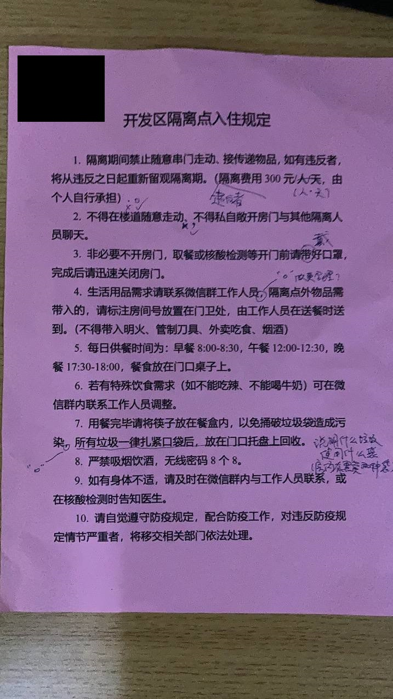
>
> Image description: A photo of a piece of paper with printed text, and handwritten comments pointing out some linguistic errors.
>
> Image 17: Spot the difference

After correcting errors, chatting, eating my noodles, and taking a bath, I lay in bed, ready to enjoy my first restful sleep in May without the aid of eszopiclone. After 27 hours of turmoil and displacement, I had finally left the surreal Shanghai for my sweet home. Yet, what did that matter? This place, like Shanghai, was unpredictable; the only predictable thing in this world is its unpredictability, and it will continue to be so.

### Epilogue

The journey out of Shanghai may have concluded, but the story was far from over. Generally, life became much more relaxed and pleasant, yet there were a few hiccups along the way.

The next morning, after a night of natural, deep sleep, I was awoken by knocks for breakfast and a COVID test. I was pleasantly surprised to rediscover my body's ability to sleep in, but as my phone relentlessly rang for the third time, my hopes for a continued sleep were dashed. The call was from my Street Office in Gaochun District, inquiring about my previous community registrations. I wondered why they needed to ask me this -- hadn't the community committee reported this already?

The 27-hour ordeal had taken a toll on my body, but the last hour alone did more damage than the previous 26. Waking up, my palms were swollen and painful -- a result of the previous night's luggage "disinfection". A day later, the cumulative physical strain, from the beginning 26 hours, finally manifested as excruciating back pain, no doubt due to carrying the heavy backpack.

During the quarantine, I underwent nine PCR tests, alternating between nasal and throat swabs, with the last one testing both. After the final test and signing a "Notice of Discharge from Collective Medical Observation", I was informed I could go home the next morning. I, along with two others, were transported in a modified truck. Its cargo area was enclosed with blue and gray iron sheets, and we boarded from the rear, giving off a distinct small-town vibe. Watching the truck drive away, I could barely make out "City Management" (城管) on its side.

What I didn't anticipate was that even after returning home, the nightmare of Shanghai continued to haunt me. Until June, I still experienced nightmares about the city. I distinctly remember two instances: In one, I inexplicably went from Nanjing back to Shanghai. Upon preparing to leave Shanghai, I realized I would have to undergo another 14-day quarantine upon returning. Resigned to my fate, I walked into a supermarket to grab something to eat, unsure of what lay ahead. In another dream, I was fleeing Shanghai and managed to get a taxi, which took me to Shanghai Hongqiao Station. However, I discovered that I had forgotten my exit permit. I asked the driver to take me back to retrieve it, but by the time I returned to the community gate with the permit in hand, the taxi was long gone.
